# Решения избранных задач

## Элементы теории графов

ну, я уже ничего не помню

## Элементы топологии

**Упражнение:** Описать все непрерывные отображения из произвольного топологического пространства $X$ в пространство с тривиальной топологией.

    
Как известно, лучше сначала решать самостоятельно

    Пусть $(X, \tau)$ -- произвольная топология. $(Y, \tau_0)$ -- тривиальная топология.
    По утверждению $\forall f: X \to Y \,\,\,\, f^{-1}(Y) = X$ и $f^{-1}(\varnothing) = \varnothing$. По теореме, если прообраз любого открытого в $Y$ множества открыт в $X$, то отображение $f$ непрерывно. По определению топологии $X$ и $\varnothing$ открыты, а значит любое отображение в пространство с тривиальной топологией непрерывно 😉 $\,\,\,\,\blacksquare$

**Упражнение:** Описать все непрерывные отображения из пространства с дискретной топологией в произвольное топологическое пространство.

    
Как известно, лучше сначала решать самостоятельно

    Пусть $(X, \tau_d)$ -- дискретная топология. $(Y, \tau)$ -- произвольная топология.
    По теореме, если прообраз любого открытого в $Y$ множества открыт в $X$, то отображение $f$ непрерывно. А любое подмножество $X$ открыто в $X$, а значит любое отображение в пространство с тривиальной топологией непрерывно 😉 $\,\,\,\,\blacksquare$

**Упражнение:** Описать все непрерывные функции на бесконечном пространстве с топологией Зарисского.

    
Как известно, лучше сначала решать самостоятельно

    Пусть $(X, \tau_z)$ -- топология Зарисского. $(Y, \tau)$ -- произвольная топология.

**Упражнение:** (Если склеить концы отрезка, то получится окружность (счастье)) Пусть $[a, b] \subset \mathbb{R}$ — стандартный отрезок. Покажите, что фактор-пространство $[a, b] / \{a, b\}$ гомеоморфно окружности.

    
Как известно, лучше сначала решать самостоятельно

    Пусть $Y = \{(x, y): \,\,\,\, x^2 + y^2 = 1\}$ -  с индуцированной топологией на $\mathbb{R}^2$.
    Рассмотрим отображение $f: [0, 1] \to Y \,\,\,\, f: t \mapsto (\cos(t), \sin(t))$. По теореме получаем, что фактор пространство $Y / f$ совпадающее с фактор пространством $[0, 1] /\{0, 1\}$ (т.к. $f(t_1) = f(t_2) \Leftrightarrow t_1 = t_2$ или $t_1 = 0, \,\,\,\, t_2 = 1$) гомеоморфно $[0, 1]$ $\,\,\,\,\blacksquare$

**Упражнение:** Пусть в пространстве $\mathbb{R}^n$ задана непрерывная функция $f(x_1, \ldots , x_n)$. Пусть $\Gamma$ -- множество нулей функции $f$, т.е. $\Gamma = \{(x_1, \ldots , x_n): \,\,\,\, f(x_1, \ldots, x_n) = 0\}$. Положим $\Omega = \mathbb{R}^n \\ \Gamma$. Докажите, что точки $P, Q \in \Omega$, в одной из которых функция $f$ положительна, а в другой -- отрицательна, лежат в разных компонентах линейной связности множества $\Omega$, т.е. их нельзя соединить непрерывной кривой, лежащей в $\Omega$.

    
Как известно, лучше сначала решать самостоятельно

    Рассмотрим функцию $g(x_1, \ldots, x_n) = \begin{cases} 1, \,\,\,\, f(x_1, \ldots, x_n) > 0 \\ 0, \,\,\,\, f(x_1, \ldots, x_n) < 0 \end{cases}$. Докажем, что $g$ локально постоянна на $\Omega$. (...). Эта функция принимает $2$ значения и [по утверждению]() постоянна на каждой компоненте линейной связности множества $\Omega$, а значит точки $P$ и $Q$ лежат в разных компонентах $\,\,\,\,\blacksquare$

## Теорема Жордана

**Упражнение:** Пусть $f(x)$ и $g(x)$ -- непрерывные функции, заданные на топологическом пространстве $X$. Докажите, что функция $h(x) = \max \{f(x), g(x)\} также непрерывна.

    
Как известно, лучше сначала решать самостоятельно

    $\max \{f(x), g(x)\} = \frac{g(x) + f(x)}{2} + \frac{|g(x) - f(x)|}{2}$, и, так как сумма, модуль, $f(x)$ и $g(x)$ непрерывны, получаем, что $\max\{f(x), g(x)\}$ -- непрерывна $\,\,\,\,\blacksquare$

**Упражнение:** Докажите, не используя теорему Жордана, что квадрат (стороны квадрата) разбивает плоскость на $2$ компоненты.

    
Как известно, лучше сначала решать самостоятельно

    Рассмотрим $f(x) = |x| + |y| - 1$ и далее [по задаче](#exercise-4) $\,\,\,\,\blacksquare$

**Упражнение:** Пусть $L \subset \mathbb{R}^2$ -- замкнутая ломаная без самопересечений такая, что для каждого ее ребра ломаная $L$  лежит в замкнутой полуплоскости, ограниченной прямой, проходящей через это ребро (такие ломаные иногда называют выпуклыми). Не используя теорему Жордана,
докажите, что $L$ разбивает плоскость на $2$ компоненты.

    
Как известно, лучше сначала решать самостоятельно

    {width=300 height=300}
    Пусть $f_i(x, y) = a_i x + b_i y + c_i$, где $a_i x + b_i y + c_i$ уравнение прямой, проходящей через $i$-ю сторону ломаной. Тогда $f(x, y) = \max\{f_1, \ldots, f_i\} = 0$ только если $(x, y) \in L$. Далее используем [упражнение](#exercise-4) $\,\,\,\,\blacksquare$

## Планарные графы

Основные факты:

**Формула Эйлера:** $v - e + f = k + 1$, где $v$ -- количество вершин, $e$ -- количество ребер, $f$ -- количество граней, $k$ -- количество компонент связности графа.

**Сакраментальные формулы:** $2e = \displaystyle \sum_{i = 1}^{f}e_i = \displaystyle \sum_{i = 1}^{v}\operatorname{deg} v_i$, где $e_i$ -- количество ребер, ограничивающих $i$-ю грань, а $\operatorname{deg} v_i$ -- степень вершины $v_i$. 

**Упражнение:** (Платоновы тела) Опишите все плоские связные простые графы, вершины которых имеют одну и ту же степень $d \ge 3$, каждая грань ограничена одним и тем же числом $k \ge 3$ ребер и каждое ребро лежит ровно в двух гранях.

    
Как известно, лучше сначала решать самостоятельно

    $$2e = \displaystyle \sum_{i = 1}^{f}e_i = \displaystyle \sum_{i = 1}^{v}\operatorname{deg} v_i = kf = dv \Rightarrow$$
    $$f = \frac{2e}{k} \,\,\,\, \,\,\,\, v = \frac{2e}{d}$$
    По формуле Эйлера $\frac{2e}{k} - e + v = 2$.
    Так как ребер положительное количество, имеем $\frac2d + \frac2k - 1 > 0 \Rightarrow \frac2d > 1 - \frac2k > \frac13$, так как $k \ge 3 \Rightarrow d < 6 \Rightarrow 3 \le d \le 5$ и, аналогично, $3 \le k \le 5$. Дальше перебор $\,\,\,\,\blacksquare$

**Упражнение:** Можно ли построить диагональную триангуляцию произвольного (в том числе, невыпуклого) плоского многоугольника?

    
Как известно, лучше сначала решать самостоятельно

    Да, можно. Гроб.

**Упражнение:** Пусть $n$ -- количество вершин триангуляцию $\Gamma$. Оцените сверху количество ребер и граней графа $\Gamma$ подходящими линейными функциями от $n$.

    
Как известно, лучше сначала решать самостоятельно

    Сакраментальные формулы $\,\,\,\,\blacksquare$

## Многогранники

**Упражнение:** Нарисуйте диаграммы Шлегеля для треугольной призмы в треугольной и в четырехугольной гранях.

    
Как известно, лучше сначала решать самостоятельно

    {width=300 height=300}
    {width=300 height=300}

**Упражнение:** Нарисуйте диаграмму Шлегеля для $4$-мерного куба.

    
Как известно, лучше сначала решать самостоятельно

    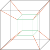{width=300 height=300}

**Упражнение:** Пусть $W$ -- многоугольник, разрезанный двумя способами, а именно, на многоугольники $F_1, \ldots, F_n$, а также на многоугольники $G_1, \ldots, G_m$. Докажите следующее утверждение: многоугольник $W$ можно разрезать на многоугольники $W_i$ так, что каждый $W_i$ лежит в некотором $F_j$ и $G_k$. В частности, каждый $F_j$ и $G_k$ разрезается на некоторые из многоугольников $W_i$.

    
Как известно, лучше сначала решать самостоятельно

    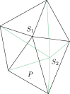{width=300 height=300}
    Проведем прямые через все стороны всех $G_i$ и $F_i$. Рассмотрим произвольную точку $P$ многоугольника $W$. Скажем, что $P$ принадлежит многоугольнику, совпадающему с пересечением полуплоскостей, на которые разбивают плоскость прямые, таких что $P$ лежит в этой полуплоскости $\,\,\,\,\blacksquare$

   

**Упражнение:** Докажите, что из равносоставленности многоугольников $A$ и $B$, а также многоугольников $B$ и $C$, вытекает равносоставленность многоугольников $A$ и $C$. Покажите, что отношение равносоставленности на плоских многоугольниках является эквивалентностью.

    
Как известно, лучше сначала решать самостоятельно

    [По упражнению](#exercise-13) $\,\,\,\,\blacksquare$

**Упражнение:** Докажите, что любой треугольник равносоставлен с некоторым параллелограммом.

    
Как известно, лучше сначала решать самостоятельно

    {width=300 height=300}

**Упражнение:** Докажите, что два параллелограмма, у которых соответственно одинаковы основания и проведенные к ним высоты, равносоставлены.

    
Как известно, лучше сначала решать самостоятельно

    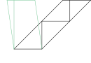{width=400 height=400}
    Разрезаем как показано на рисунке (восстанавливаем высоту до пересечения, если пересечение не со вторым основание, то продолжаем восстанавливать высоты). Получаем, что оба параллелограмма равносоставлены однуму и тому же прямоугольнику. Далее [по упражнению](#exercise-13) $\,\,\,\,\blacksquare$

**Упражнение:** Докажите, что любые два прямоугольника равных площадей равносоставлены.

    
Как известно, лучше сначала решать самостоятельно

    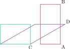{width=300 height=300}
    Пусть даны прямоугольники такой и такой. Построим такой параллелограмм, так, чтобы $AB = CD$. Получили параллелограмм и параллелограмм(прямоугольник), у которых равны основания ($AB = CD$) и высоты, так как площади исходных прямоугольников равны. Далее [по упражнению](#exercise-16) $\,\,\,\,\blacksquare$

**Упражнение:** Докажите, что конечный набор прямоугольников равносоставлен с любым прямоугольником суммарной площади.

    
Как известно, лучше сначала решать самостоятельно

    Пусть суммарная площадь $S$, конечный набор прямоугольников $P_1, \ldots, P_n$. Каждый $P_i$ равносоставлен некоторому прямоугольнику $L_i$ со стороной $\sqrt{S}$ [по предыдущему упражнению](#exercise-17). А так суммарная площадь $S$ сумма высот $L_i$ равна $\sqrt{S}$. Значит конечный набор прямоугольников равносоставлен с квадратом суммарной площади, а [квадрат равносоставлен с любым прямоугольником такой же площади](#exercise-17) $\,\,\,\,\blacksquare$

**Упражнение:** Докажите теорему Бойяи–Валласа–Гервина, а именно: любые два многоугольника одинаковой площади равносоставлены.

    
Как известно, лучше сначала решать самостоятельно

    Любой многоугольник триангулируем. [Любой треугольник равносоставлен с некоторым прямоугольником](#exercise-15). [Любой конечный набор прямоугольников равносоставлен с квадратом суммарной площади](#exercise-18). Значит по [транзитивности](#exercise-14) любые два многоугольника одинаковой площади равносоставлены $\,\,\,\,\blacksquare$

:::: {#definition-0}

**Определение:**  Пусть $W$ -- многогранник с множеством ребер $E$, и $M$ -- некоторое множество вещественных чисел, содержащее длины всех ребер из $E$. Пусть $f$ -- произвольная функция Дена для $W$, и $g: M \to \mathbb{R}$ -- произвольная аддитивная функция. Тогда *обобщенным инвариантом Дена многогранника* $W$, соответствующим паре $(f, g)$, назовем число $\displaystyle \sum_{e \in E}g(|e|)f(|\alpha_e|)$, где $|e|$ и $\alpha_e$ -- длина ребра $e$ и величина двугранного угла при этом ребре соответственно.

::::

**Упражнение:** Докажите, что у равносоставленных многогранников обобщенные инварианты Дена равны.

    
Как известно, лучше сначала решать самостоятельно

    Когда-нибудь я докажу это в лекциях 😎

**Упражнение:** Докажите, не пользуясь иррациональностью конкретных чисел, что среди правильных пирамид (основание -- правильный многоугольник, а высота попадает в центр основания) имеются неравносоставленные с равновеликим кубом.

Как известно, лучше сначала решать самостоятельно

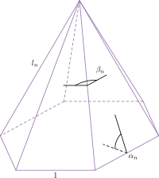{width=400 height=400}
Пусть длина ребер основания пирамиды $1$, длина боковых ребер $l_h$, двугранный угол между боковыми гранями $\beta_h$, двугранный угол между боковой гранью и основанием $\alpha_h$. Запишем инвариант Дена для такой пирамиды $n \cdot 1 \cdot f(\alpha_h) + l_h \cdot n \cdot f(\beta_h)$. Пусть $g$ -- аддитивная функция, такая, что $g(0) = 1$ (почему существует?). Запишем обобщенный инвариант Дена для пирамиды: $g(l_h) \cdot n \cdot f(\beta_h)$. Так как инвариант Дена для куба равен $0$, хотим доказать, что существую $l_h$ и $\beta_h$, такие, что $g(l_h) \cdot f(\beta_h) \ne 0$ 
Будем рассматривать $\mathbb{R}$, как векторное протсранство над $\mathbb{Q}$.
    
:::: {#definition-1}

**Определение:**  Пусть $V$ бесконечномерное векторное пространство. *Базис Гамеля* $V$ -- это $F \subset V$, такая, что:

1. $F$ -- линейно независима, то есть $\forall \displaystyle \sum_{i = 1}^{m}\lambda_i f_i \Rightarrow \lambda_i = 0$ (любая конечная линейная комбинация линейно независима)
2. $F$ -- полна, то есть любой $v \in V$ представим в виде линейной комбинации $f_i$.

::::

**Факт 1:** Для любого векторного пространства существует базис Гамеля.

**Факт 2:** Любая линейно независимая система дополняется до базиса.

Возьмем $\{1\} \in \mathbb{R}$, дополним до базиса $F$. Определим $g(1) = 0, g(f_1) = f_1, \ldots$. Тогда $\ker g = \mathbb{Q}$. Пусть $f = \pi \cdot g$. Тогда $f$ -- функция Дена и $\ker f = \pi \mathbb{Q}$. 
Какова мощность множества $\{(l_h, \beta_h): \,\,\,\, g(l_n) \cdot f(\beta_n) = 0\}$? Счетная, так как и мощность ядра $f$, и мощность ядра $g$ счетная. А всего пар $(l_h, \beta_h)$ континнум, а значит существует правильная пирамида неравносоставленная с равновеликим кубом $\,\,\,\,\blacksquare$

## Замкнутые двумерные поверхности

**Упражнение:** Пусть на поверхности нарисован граф, причем каждая из областей, на которые он делит поверхность, гомеоморфна диску. *Эйлеровой характеристикой* такой карты называется число $v - e + f$, где $v$ -- число вершин, $e$ -- число ребер и $f$ -- число областей. Докажите, что эйлеровы характеристики любых двух карт на поверхности совпадают. Указание: рассмотрите карту, получающуюся “наложением” двух карт, т.е. объединением их границ.

**Упражнение:** Эйлеровой характеристикой поверхности называется число
$\chi = v - e + f$, где $v$, $e$ и $f$ -- числа вершин, ребер и областей любой карты, нарисованной на поверхности (согласно утверждению из [упражнения](#exercise-22), это число не зависит от карты и, тем самым, характеризует саму поверхность). Вычислите
эйлеровы характеристики цилиндра, тора и ленты Мебиуса.

Как известно, лучше сначала решать самостоятельно

$$\chi(цилиндра) = 2 - 3 + 1 = 0$$
$$\chi(T^2) = 1 - 2 + 1 = 0$$
$$\chi(ленты Мёбиуса) = 4 - 6 + 2 = 0$$

**Упражнение:** Поверхность $M$ получается из поверхности $N$ вырезанием $k$ дисков. Выразите $\chi(M)$ через $\chi(N)$.

Как известно, лучше сначала решать самостоятельно

$$e_M = e_N$$
$$v_M = v_N$$
$$f_M = f_N - k$$
$$\chi(M) = v_M - e_M + f_M = v_N - e_N + f_N - k = \chi(N) - k \,\,\,\,\blacksquare$$

**Упражнение:** Каждая из двух поверхностей $M$ и $N$ имеет край, представляющий собой замкнутую кривую, состоящую из одного куска. Поверхность $Q$ получается из поверхностей $M$ и $N$ склеиванием краев. Выразите $\chi(Q)$ через $\chi(M)$ и $\chi(N)$.

Как известно, лучше сначала решать самостоятельно

    
$$\chi(Q) = \chi(M\#N) = \chi(M) + \chi(N) - 2 \,\,\,\,\blacksquare$$

**Упражнение:** Вычислите эйлерову характеристику

1. поверхности $M^m_g$, полученной из сферы с $g$ ручками вырезанием $m$ дырок;
2. поверхности $N^m_h$, полученной из сферы с $h$ пленками Мёбиуса вырезанием $m$ дырок.

Как известно, лучше сначала решать самостоятельно

Приклеивание ручки = вырезание двух дырок

1. $$\chi(M_{g + 1}) = \chi(M_g\#T) = \chi(M_g) + 0 - 2 = 2 - 2g - 2 = 2 - 2(g + 1)$$

$$\chi(M^m_g) = \chi(M_g) - m = 2 - 2g - m$$

2. $$\chi(T\#\mathbb{R}P^2) = N_3 = \chi(\mathbb{R}P^2\#\mathbb{R}P^2\#\mathbb{R}P^2) \Rightarrow \chi(\mathbb{R}P^2) = 1$$

$$\chi(N_{h + 1}) = \chi(N_h\#\mathbb{R}P^2) = \chi(N_h) + 1 - 2 = 2 - h + 1 - 2 = 2 - (h + 1)$$

$$\chi(N^m_h) = 2 - h - m \,\,\,\,\blacksquare$$

**Упражнение:** Сторонам многоугольника приписаны буквы $a, b, c, \ldots$ в следующем порядке: $a, b, a, b, c, d, c, d, \ldots$ Затем стороны, помеченные одноименными буквами, склеиваются, причем стрелка на каждой стороне направлена по направлению обхода, когда соответствующая буква встречается первый раз, и против направления обхода, когда буква встречается
второй раз. Докажите, что, если число разных букв равно $2g$, то полученная поверхность гомеоморфна сфере с $g$ ручками.

Как известно, лучше сначала решать самостоятельно

$$aba^{-1}b^{-1}cdc^{-1}d^{-1}\ldots \cong M_g \,\,\,\,\blacksquare$$

**Упражнение:** Сторонам многоугольника приписаны буквы $a, b, c, \ldots$ в следующем порядке: $a, a, b, b, c, c, d, d, \ldots$ Затем стороны, помеченные
одноименными буквами, склеиваются, причем стрелка на каждой стороне направлена по направлению обхода. Докажите, что, если число разных букв равно $h$, то полученная поверхность гомеоморфна сфере с $h$ пленками Мебиуса.

Как известно, лучше сначала решать самостоятельно

$$a^2b^2\ldots \cong N_h \,\,\,\,\blacksquare$$

**Упражнение:** На замкнутой ориентируемой поверхности нарисована карта, причем каждая сторона представляет собой некоторый $n$-угольник, и
в каждой вершине сходится по $k$ ребер. Докажите, что $$\frac1n + \frac1k = \frac12 + \frac{\chi}{2e}$$, где $\chi$ эйлерова характеристика поверхности, а $e$ -- число ребер карты. Приведите пример такой карты на сфере при $n = 2$, $k = 4$.

Как известно, лучше сначала решать самостоятельно

Пример: мяч.

Пусть поверхность $M$, карта $S$.
$$\displaystyle \sum_{i = 1}^{v}k = 2e \Rightarrow 2e = vk$$
$$2e = nf$$
$$\chi(M) = v - e + f \Rightarrow \frac{2e}k - e + \frac{2e}n = \chi \,\,\,\,\blacksquare$$

**Упражнение:** Вычислите эйлеровы характеристики бутылки Клейна
и проективной плоскости.

Как известно, лучше сначала решать самостоятельно

1. $\chi(KL) = \chi(abab^{-1}) = \chi(a^2(b^{-1})^2) = 2 - 2 = 0$
2. $\chi(T\#\mathbb{R}P^2) = N_3 = \chi(\mathbb{R}P^2\#\mathbb{R}P^2\#\mathbb{R}P^2) \Rightarrow \chi(\mathbb{R}P^2) = 1 \,\,\,\,\blacksquare$

# Граф: определения

:::: {#definition-2}

**Определение:**  $V^{(k)}$ -- это множество всех $k$-элементных подмножеств множества $V$.

::::

:::: {#definition-3}

**Определение:**  *Граф* -- это тройка $\{E, V, \sigma\}$, где $E$ -- *множество ребер* ($e \in E$ -- *ребро*) $V$ -- *множество вершин* ($v \in V$ -- *вершина*) $\sigma: \,\,\,\, E \to V^{(1)} \cup V^{(2)}$ -- *отношение инцидентности ребер и вершин*.  Если $\sigma(e) \in V^{(1)}$, то $e$ -- *петля*. Если $\sigma(e) \in V^{(2)} = \{u, v\}$, то вершина $u$ *смежная* (*соседняя к*) вершине $v$. Если $v \in \sigma(e)$, то вершина $v$ *инцидентна* ребру $e$. Если $\sigma(e) = \sigma(e’)$, то $e$ и $e’$ *кратные ребра*. 

::::

:::: {#definition-4}

**Определение:**  Граф *простой*, если в нем нет петель и кратных ребер. 

::::

Часто записывается $G = \{E, V\}$, вместо $\{E, V, \sigma\}$.

:::: {#definition-5}

**Определение:**  *Степень вершины* $v \in V$ графа $G = \{E, V, \sigma\}$ -- это сумма количества ребер инцидентных $v$ и не являющихся петлями и удвоенного количества петель инцидентных $v$.

::::
Обозначается: $\operatorname{deg}v$.

:::: {#statement-0}

**Утверждение:**  $$\displaystyle \sum_{v \in V}\operatorname{deg}v = 2|E|$$

*Доказательство:* $\,\,\,\,\blacksquare$

::::

:::: {#definition-6}

**Определение:**  *Маршрут* (между вершинами $v_0$ и $v_k$) в графе $G = \{E, V, \sigma\}$ -- это последовательность $v_0, e_1, v_1, e_2, v_2, \ldots, e_k, v_k$, где $v_i \in V \,\,\,\,\forall i \in \{0, \ldots, k\}, \,\,\,\, e_i \in E \,\,\,\,\forall i \in \{1, \ldots, k\}$ и ребро $e_i$ инцидентно вершинам $v_{i - 1}$ и $v_i$.  Если в маршруте $\forall i \ne j \,\,\,\, e_i \ne e_j$, то маршрут -- это *цепь*. Если в маршруте $v_0 = v_k$, то маршрут *замкнутый*. Замкнутая цепь -- это *цикл*. Если в маршруте $\forall i \ne j \ne 0 \ne k \,\,\,\, v_i \ne v_j$, то маршрут -- это *путь*. Замкнутый путь -- это *простой цикл*.

::::

:::: {#definition-7}

**Определение:**  Граф $G = \{E, V , \sigma\}$ *связный*, если $\forall u, v \in V$ существует маршрут между $u$ и $v$. 

::::

## Эйлеров граф

:::: {#definition-8}

**Определение:**  *Эйлеров обход графа (эйлеров цикл)* -- это цикл, содержащий все вершины графа.

::::

:::: {#definition-9}

**Определение:**  Если в графе существует эйлеров цикл, то граф -- *эйлеров*.

::::

:::: {#theorem-0}

**Теорема:**  Граф эйлеров $\Leftrightarrow$ граф связный и степени всех вершин графа четны.

*Доказательство:* $$\Rightarrow$$

::::
Граф эйлеров, значит существует цикл, содержащий все вершины графа. Идя по этому циклу, в каждую вершину нужно зайти и выйти, то есть степень любой вершины четна.

$$\Leftarrow$$

Степени всех вершин четны, граф конечный и связный. Начнем в какой-нибудь вершине и будем строить цикл, выбирая каждый раз следующей непосещенную вершину, так как граф конечный этот процесс завершится и будет получен искомый цикл $\,\,\,\,\blacksquare$ (Плохо)

## Гамильтонов граф

:::: {#definition-10}

**Определение:**  *Гамильтонов цикл* -- это простой цикл, проходящий через все вершины графа.

::::

:::: {#definition-11}

**Определение:**  Граф *гамильтонов*, если в нем есть гамильтонов цикл.

::::

:::: {#statement-1}

**Утверждение:**  Пусть $G = \{E, V, \sigma\}$ гамильтонов граф. Тогда

1. $G$ связный.
2. Если $|V| > 1$, то в $G$ нет петель.
3. Если $|V| > 2$, то в $G$ нет кратных ребер.

*Доказательство:*

::::

1. Гамильтонов цикл проходит через все вершины.
2. Гамильтонов цикл проходит через вершину ровно один раз.
3. см 2. $\,\,\,\,\blacksquare$

То есть для определения гамильтоновости графа достаточно рассматривать простые графы.

:::: {#theorem-1}

**Теорема:**  (Дирака) Пусть $G = \{E, V, \sigma\}$ -- простой граф, $|V| = n, \,\,\,\, n \ge 3, \,\,\,\, \forall v \,\,\,\, \operatorname{deg}v \ge \frac{n}{2}$. Тогда $G$ гамильтонов.

*Доказательство:* 

::::

Идея: Построить самый длинный путь в графе $G$. Пусть его длина $l$. Доказать, что можно получить цикл длины $l + 1$. Предположить, что полученный цикл не гамильтонов. Прийти к противоречию. Всё!
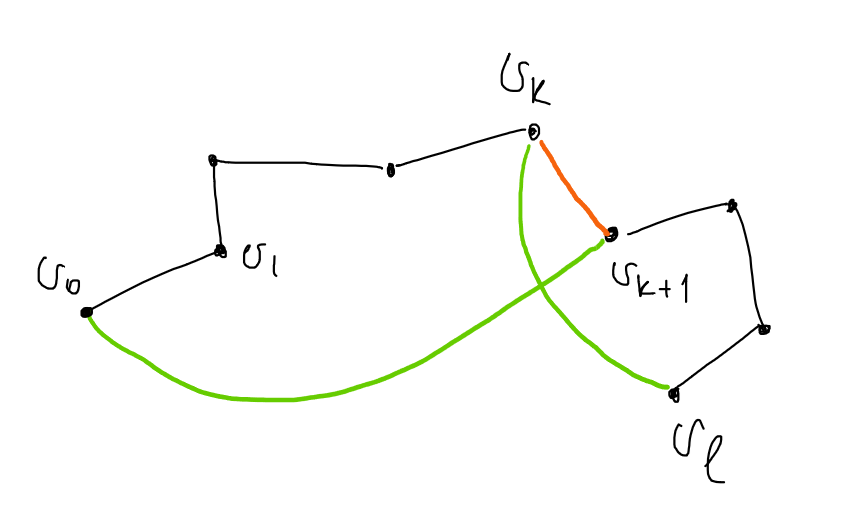

Пусть $\gamma = v_0v_1\ldots v_{l-1}v_l$ самый длинный путь в графе. Докажем существование цикла длины $l + 1$.
Если $v_0$ и $v_l$ смежны, то таким циклом является последовательность $v_0v_1\ldots v_{l-1}v_lv_0$.
Иначе хотим найти вершину $v_k \in \gamma$, такую чтобы следующая за ней в пути вершина была смежна с $v_0$, а сама $v_k$ была смежна с $v_l$ (см. рисунок). Если доказать существование такой вершины, то искомым циклом будет $v_0\ldots v_kv_l\ldots v_{k + 1}v_0$ (на рисунке черный путь + оранжевое ребро -- это $\gamma$, а черные ребра + зеленые -- это искомый цикл).

Рассмотрим множества: $X = \{v_i: \,\,\,\, v_iv_l \in E\}$ и $Y = \{v_i: \,\,\,\, v_{i + 1}v_0 \in E\}$.
Все вершины смежные с $v_0$ принадлежат пути, потому что иначе можно было бы увелечить длину пути.
$|X| = \operatorname{deg}v_l \ge \frac{n}{2}, \,\,\,\, |Y| = \operatorname{deg}v_0 \ge \frac{n}{2} \Rightarrow |X| + |Y| \ge n$. Пусть $X \cap Y = \varnothing$. Тогда $|X \cup Y| = |X| + |Y| \ge n$, но вершина $v_l \not \in X$ и $v_l \not \in Y \Rightarrow$ в графе больше $n$ вершин. Противоречие, а значит $\exists v_k: \,\,\,\, v_k \in X \cap Y$.

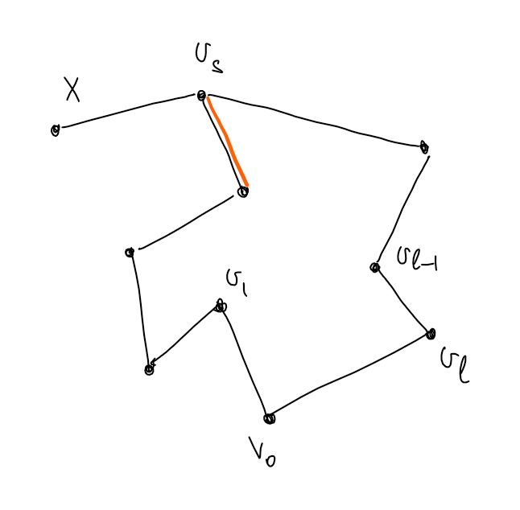

Докажем, что полученный цикл $C$ гамильтонов. Предположим обратное, тогда $\exists v \in V: \,\,\,\, v \not\in \gamma$. Пусть $v$ смежна с вершиной $v_s$ из цикла $C$. Тогда выбросив любое из смежных с $v_s$ ребер, принадлежащих $C$ получим путь длины $l + 1$. Противоречие. Значит $v$ не смежна ни с одной вершиной $C$. Вершин смежных с $v \ge \frac{n}{2}$. Вершин смежных с $v_0 \ge \frac{n}{2}$ и все они принадлежат $C$. Значит в графе больше, чем $n$ вершин. Противоречие. Следовательно, $C$ гамильтонов цикл $\,\,\,\,\blacksquare$

## Подграфы

:::: {#definition-12}

**Определение:**  $H = (V_H, E_H, \sigma_H)$ *подграф* графа $G = (V_G, E_G, \sigma_G)$, если $V_H \subset V_G, \,\,\,\, E_H \subset E_G, \,\,\,\, \sigma_H = \sigma_G |_{E_H}$.

::::

:::: {#definition-13}

**Определение:**  Подграф *остовный*, если содержит все вершины исходного.

::::

:::: {#definition-14}

**Определение:**  Пусть $M \subset V, \,\,\,\, G = (V, E, \sigma)$. Обозначим $G(M) = (M, E_M = \{\sigma^{-1}(M^{(1)} \cup M^{(2)}), \sigma |_{E_M}\})$.

::::

:::: {#statement-2}

**Утверждение:**  Пусть $M \subset V, \,\,\,\, G = (V, E, \sigma)$. Тогда $G(M)$ -- подграф $G$.

*Доказательство:* очев $\,\,\,\,\blacksquare$

::::

:::: {#definition-15}

**Определение:**  Пусть $G = (V, E, \sigma), \,\,\,\, w \in W, \,\,\,\, v \in V$. 

::::

$w \sim v$ (*эквивалентно*), если существует маршрут из $w$ в $v$.

:::: {#statement-3}

**Утверждение:**  Введенная выше "$\sim$" является отношением эквивалентности на множестве вершин графа.

*Доказательство:* $\,\,\,\,\blacksquare$

::::

:::: {#definition-16}

**Определение:**  Класс эквивалентности вершины $v$ графа $G$ обозначается $[v]$.

::::

:::: {#definition-17}

**Определение:**  *Компонента связности* вершины $v$ графа $G$ -- это максимальный по включению подграф, содержащий $v$.

::::

:::: {#statement-4}

**Утверждение:**  $G([v])$ -- это компонента связности вершины $v$.

# Деревья

:::: {#definition-18}

**Определение:**  *Дерево* -- это связный граф без циклов.

::::

**Теорема:** Пусть $G = \{V, E\}$ -- граф, $|V| = n, \,\,\,\, |E| = m$. Следующие утверждения эквивалентны.

1. $G$ -- дерево.
2. $G$ связный и $n = m + 1$.
3. $G$ не содержит циклов и $n = m + 1$.
4. В $G$ между любыми двумя вершинами существует единственный маршрут.
5. $G$ не содержит циклов и в графе, содержащем ребро между двумя несмежными вершинами $G$, существует ровно один цикл.

*Доказательство:*

::::

$$1 \Rightarrow 2$$
Докажем индукцией по количеству вершин. База: $n = 1$ тогда ребер $0$, так как нет петель, то есть $n = 1 = 0 + 1$ что и требовалось. Пусть $n \ge 2$ и для деревьев с меньшим, чем $n$ числом вершин верно $n = m + 1$. Тогда возьмем произвольное ребро $e$(множество ребер непусто, так как граф связный) и рассмотрим $G\setminus e$.

:::: {#lemma-0}

**Лемма:**  Пусть $G$ --- дерево, $e$ -- произвольное ребро в нем. Тогда граф $G$ без ребра $e$ содержит $2$ компоненты связности, каждая из которых -- дерево.

*Доказательство:* Пусть $e$ соединяет $v_1$ и $v_2$. $G$ -- связный, значит, убрав одно ребро получим $1$ или $2$ компоненты связности. Если получим одну компоненту, то существует маршрут из $v_1$ в $v_2$. Следовательно, в $G$ был цикл. Противоречие. Получили две компоненты связности, каждая из которых не содержит циклов, так как циклов нет в $G \,\,\,\,\blacksquare$

::::

Для $2$-ух полученных компонент связности -- деревьев верно предположение индукции. Пусть в первом и втором деревьях $n_1, n_2, m_1, m_2$ вершин и ребер соответственно. Тогда $n_1 = m_1 + 1, \,\,\,\, n_2 = m_2 + 1$. $n = n_1 + n_2 = m_1 + 1 + m_2 + 1 = (m_1 + m_2 + 1) + 1 \,\,\,\,\blacksquare$ (в $G$ $m_1 + m_2 + 1$ -- ребер)

$$2 \Rightarrow 3$$

Пусть $G$ содержит цикл.

:::: {#lemma-1}

**Лемма:**  Пусть простой граф $G$ содержит $n$ вершин, $m$ ребер и $k$ компонент связности. Тогда $n - m \le k$.

*Доказательство:* Докажем индукцией по количеству ребер. Для $m = 0 \,\,\,\, n = k$, что и требовалось. Пусть ребер $m \ge 1$ и для всех графов с меньшим числом вершин утверждение выполнено. Тогда выберем произвольное ребро $e$ и рассмотрим граф без него. Убрав ребро, получим либо $k$ компонент связности либо $k + 1$. Для графа $G \\ e$ верно $n’ - m’ \le k’$, $m’, \,\,\,\, n’, \,\,\,\, k’$ -- количество ребер, вершин и компонент связности $G\setminus e \,\,\,\,\blacksquare$

::::

Рассмотри граф $G$ без произвольного ребра $e$, входящего в цикл. $G\setminus e$ связный, так как $e$ входило в цикл. То есть в $G$ - $n$ вершин и $n - 2$ ребер, что противоречит [лемме](#lemma-1) $\,\,\,\,\blacksquare$

$$3 \Rightarrow 4$$
Единственность маршрута при его существовании очевидна. Маршрут существует между любыми двумя вершинами $G$, так как, предположив, что в $G$ - $k$ компонент связности(которые не содержат циклов, а следовательно деревья) получим, что $n =$ сумма количества вершин в каждой компоненте = сумма количества ребер в каждой компоненте + $k$(по $1 \Rightarrow 2$) $= m + 1 \,\,\,\,\blacksquare$

$$4 \Rightarrow 5$$

Если в $G$ есть цикл, то нарушается условие о единственности маршрута. Добавив ребро, получим цикл, так как маршрут существует между любыми двумя вершинами. Если получим больше одного цикла, то они оба содержат добавленное ребро, а следовательно существует цикл в $G \,\,\,\,\blacksquare$ 

$$5 \Rightarrow 1$$

$G$ -- связный, так как для каждой пары вершин существует маршрут между ними $\,\,\,\,\blacksquare$

# Топология и топологическое пространство

:::: {#definition-19}

**Определение:**  Пусть задано множество $X$ и некоторое семейство его подмножеств $\tau$. Тогда $\tau$ -- *топология* на множестве $X$, если выполнены следующие аксиомы:

::::

1. $\varnothing \in \tau$ и $X \in \tau$.
2. Любое объединение множеств из $\tau$ является элементом $\tau$.
3. Любое конечное пересечение множеств из $\tau$ является элементом $\tau$.

:::: {#definition-20}

**Определение:**  Пара $(X, \tau)$, где $X$ -- множество, а $\tau$ -- топология на нем -- *топологическое пространство*.

::::

:::: {#definition-21}

**Определение:**  Пусть $(X, \tau)$ -- топологическое пространство. Элементы множества $X$ -- *точки*.

::::

:::: {#definition-22}

**Определение:**  Пусть $(X, \tau)$ -- топологическое пространство. Множество $U \in \tau$ -- *окрестность точки* $x \in X$, если $x \in U$.

::::

:::: {#definition-23}

**Определение:**  Пусть $(X, \tau)$ -- топологическое пространство. Множества $U \in \tau$ -- *открытые* в топологическом пространстве $(X, \tau)$.

::::

:::: {#statement-5}

**Утверждение:**  Множество всех подмножеств $X$ -- это топология.

*Доказательство:* $\,\,\,\,\blacksquare$

::::

:::: {#definition-24}

**Определение:**  Такая топология называется *дискретной* и обозначается $\tau_d$.

::::

:::: {#definition-25}

**Определение:**  Топология, состоящая из самого множества $X$ и пустого множества $\varnothing$ называется *тривиальная* и обознаяается $\tau_0$.

::::

:::: {#definition-26}

**Определение:**  Система множеств на множестве $X$, состоящая из пустого множества, а также из всех подмножеств множества $X$, дополнения до которых конечны -- *топология Зарисского*. Обозначается: $\tau_z$.

::::

## Метрическая топология

:::: {#definition-27}

**Определение:**  Пусть $X$ -- множество. Отображение $\rho: X\times X \to \mathbb{R}$ -- *метрика*, если:

::::

1. $\forall x, y \in X \,\,\,\, \rho(x, y) \ge 0$, причем $\rho(x, y) = 0 \Leftrightarrow x = y$.
2. $\forall x, y \in X \,\,\,\, \rho(x, y) = \rho(y, x)$.
3. $\forall x, y, z \in X \,\,\,\, \rho(x, y) + \rho(y, z) \ge \rho(x, z)$.

:::: {#definition-28}

**Определение:**  Пара $(X, \rho)$, где $X$ -- множество, а $\rho$ -- метрика на нем -- *метрическое пространство*, элементы множества $X$ -- *точки*, $\forall x, y \in X \,\,\,\, \rho(x, y)$ -- *расстояние между точками* $x$ и $y$.

::::

:::: {#definition-29}

**Определение:**  Пусть $V$ -- линейное пространство над полем $\mathbb{R}$. Отображение $h: V \to \mathbb{R}$ -- *норма*, если:

::::

1. $\forall x \in V \,\,\,\, h(x) \ge 0$, причем $h(x) = 0 \Leftrightarrow x = 0$.
2. $\forall x \in V, \,\,\,\, \lambda \in \mathbb{R} \,\,\,\, |\lambda| h(x) = h(\lambda x)$.
3. $\forall x, y \in V \,\,\,\, h(x + y) \le h(x) + h(y)$. 

:::: {#definition-30}

**Определение:**  Пусть $(X, \rho)$ -- метрическое пространство.  *Открытый шар радиуса* $\varepsilon$ *с центром в точке* $x \in X$ -- это множество $\{y \in X| \,\,\,\, \rho(x, y) < \varepsilon\}$. Обозначается: $O_{\varepsilon}(x)$. Пусть $A \subset X$.  Точка $x$ -- *внутренняя точка* множества $A$, если $\exists O_{\varepsilon}(x) \subset A$.  Множество всех внутренних точек $A$ -- *внутренность* $A$. Обозначается: $\operatorname{Int} A$.  Множество $A$ -- *открыто* в метрическом пространстве $(X, \rho)$, если $\operatorname{Int} A = A$.

::::

:::: {#statement-6}

**Утверждение:**  Пусть $(X, \rho)$ -- метрическое пространство. Тогда любое объединение открытых в $(X, \rho)$ множеств открыто в $(X, \rho)$, а любое конечное пересечение открытых в $(X, \rho)$ множеств открыто в $(X, \rho)$.

*Доказательство:* $\,\,\,\,\blacksquare$

::::

**Упражнение:** Почему любое пересечение открытых множеств не является открытым?

:::: {#corollary-0}

**Следствие:**  Пусть $(X, \rho)$ -- метрическое пространство. Тогда семейство всех открытых в $(X, \rho)$ множеств -- топология на $X$.

*Доказательство:* $\,\,\,\,\blacksquare$

::::

:::: {#definition-31}

**Определение:**  Пусть $(X, \rho)$ -- метрическое пространство. Топология, состоящая из всех открытых в $(X, \rho)$ множеств называется *метрической* и обозночается $\tau_{\rho}$.

::::

## Топология на базе окрестностей

:::: {#definition-32}

**Определение:**  Пусть $X$ -- множество. Тогда семейство $\beta$ его подмножеств -- *база окрестностей*, если:

::::

1. $\forall x \in X \,\,\,\, \exists U \in \beta: \,\,\,\, x \in U$.
2. $\forall U, W \in \beta: \,\,\,\, \exists x \in X, \,\,\,\, x \in U \cap W \,\,\,\, \exists V \in \beta: \,\,\,\, x \in V \subset U \cap W$.

Элементы множества $X$ -- *точки*.

Любое множество $U \in \beta: \,\,\,\, x \in U$ - $\beta$-*окрестность точки* $x$.

Подмножество $A$ множества $X$ -- *открыто*, если каждая его точка содержится в $A$ вместе с какой-то своей $\beta$-окрестностью. Пустое множество открыто по определению.

:::: {#statement-7}

**Утверждение:**  Каждый элемент базы окрестностей открытое множество для этой базы.

*Доказательство:* $\,\,\,\,\blacksquare$

::::

:::: {#statement-8}

**Утверждение:**  Для любого непустого конечного пересечения элементов базы и любого элемента этого пересечения существует элемент базы, содержащийся в этом пересечении и содержащий элемент пересечения. (Интересно, это возможно понять? можно)

*Доказательство:* индукция по количеству элементов в пересечении с базой пункт $2$ определения базы $\,\,\,\,\blacksquare$

::::

:::: {#statement-9}

**Утверждение:**  Пусть задано множество $X$ и его база окрестностей $\beta$. Множество $A \subset X$ -- открыто $\Leftrightarrow A = \displaystyle\cup U_{\alpha}, \,\,\,\, U_{\alpha} \in \beta$.

*Доказательство:* Пусть множество открыто. Тогда оно является объединением окрестностей своих точек. Обратно, каждая окрестность открытое множество, а их объединение открыто $\,\,\,\,\blacksquare$

::::

:::: {#statement-10}

**Утверждение:**  Пусть задано множество $X$ и его база окрестностей $\beta$. Тогда множество $\tau_{\beta}$ всех открытых относительно базы $\beta$ множеств -- топология на $X$.

*Доказательство:* $\,\,\,\,\blacksquare$

::::

:::: {#definition-33}

**Определение:**  $\tau_{\beta}$ -- *топология с базой* $\beta$.

::::

## Замкнутые подмножества

:::: {#definition-34}

**Определение:**  Пусть задано топологическое пространство $(X, \tau)$. $A \subset X$ -- *замкнуто*, если его *дополнение* $X \setminus A$ открыто.

::::

:::: {#statement-11}

**Утверждение:**  (свойства замкнутых подмножеств) Пусть задано топологическое пространство $(X, \tau)$. Тогда

1. $\varnothing$ и $X$ замкнуты.
2. Любое пересечение замкнутых множеств замкнуто.
3. Любое конечное объединение замкнутых множеств замкнуто.

*Доказательство:*

::::

:::: {#definition-35}

**Определение:**  Пусть задано метрическое пространство $(X, \rho)$. Точка $X \in X$ -- *точка прикосновения* множества $A \subset X$, если $\forall O_{\varepsilon}(x) \,\,\,\, O_{\varepsilon}(x) \cap A \ne \varnothing$.  Множество всех точек прикосновения множества $A \subset X$ -- *замыкание* $A$. Обозначается: $\operatorname{Cl}A$.  Множество $A \subset X$ -- *замкнуто*, если $\operatorname{Cl}A = A$.

::::

:::: {#statement-12}

**Утверждение:**  Пусть задано метрическое пространство $(X, \rho)$. Тогда множество $A \subset X$ открыто $\Leftrightarrow X \setminus A$ замкнуто.

*Доказательство:* $\,\,\,\,\blacksquare$

::::

## Топологические внутренность и замыкание

:::: {#definition-36}

**Определение:**  Пусть $(X, \tau)$ -- топологическое пространство, $A \subset X$. Точка $x \in X$ *внутренняя (точка)* множества $A$, если существует ее окрестность, содержащаяся в $A$. Точка $x \in X$ *точка  прикосновения* множества $A$, если пересечение любой ее окрестности с $A$ непусто.

::::

:::: {#definition-37}

**Определение:**  Пусть $(X, \tau)$ -- топологическое пространство, $A \subset X$.  Множество всех внутренних точек $A$ -- *внутренность* $A$. Обозначается: $\operatorname{Int} A$.  Множество всех точек прикосновения $A$ -- *замыкание* $A$. Обозначается: $\operatorname{Cl} A$.

::::

:::: {#statement-13}

**Утверждение:**  Пусть $(X, \tau)$ -- топологическое пространство, $A \subset X$. Тогда 

$A$ замкнуто $\Leftrightarrow \operatorname{Cl}A = A$.

$A$ открыто $\Leftrightarrow \operatorname{Int}A = A$.

*Доказательство:* $\,\,\,\,\blacksquare$

::::

:::: {#statement-14}

**Утверждение:**  Пусть топология на $X$ задана с помощью базы окрестностей $\beta$. Тогда 

$x \in X$ -- внутренняя точка $A \subset X \Leftrightarrow \exists U \in \beta: \,\,\,\, x \in U \subset A$,

$x \in X$ -- точка прикосновения $A \subset X \Leftrightarrow \forall U \in \beta: \,\,\,\, x \in U \,\,\,\, U \cap A \ne \varnothing$.

*Доказательство:* $\,\,\,\,\blacksquare$

::::

:::: {#definition-38}

**Определение:**  Топологическая *граница* множества $A \subset X$ -- это $\operatorname{Cl}A \setminus \operatorname{Int}A$.

::::

## Непрерывные отображения

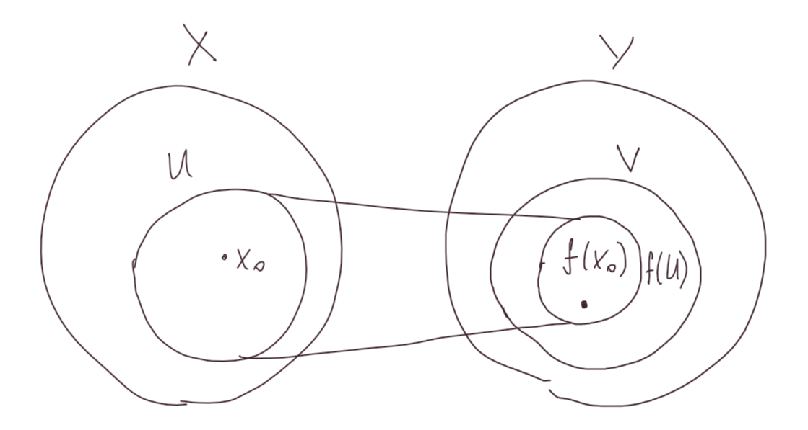

:::: {#definition-39}

**Определение:**  Пусть заданы топологические пространства $(X, \tau_x)$ и $(Y, \tau_y)$. Отображение $f: X \to Y$ *непрерывно в точке* $x_0 \in X$, если для каждой окрестности $V$ точки $f(x_0)$ в $Y$ существует окрестность $U$ точки $x_0$ в $X$, такая что $f(U) \subset V$.

::::

$f$ *непрерывно*, если оно непрерывно в каждой точке $x \in X$.

:::: {#definition-40}

**Определение:**  Пусть заданы топологические пространства $(X, \tau_x)$ и $(Y, \tau_y)$, непрерывное отображение $f: X \to Y$.  $x \in X$ *прообраз* точки $y \in Y$, если $f(x) = y$. $f^{-1}(y) = \{x \in X: \,\,\,\, f(x) = y\}$ -- *полный прообраз* точки $y in Y$. $A \subset Y, \,\,\,\, f^{-1}(A) = \{x \in X: \,\,\,\, f(x) \in A\}$ -- *прообраз множества* $A$.

::::

:::: {#statement-15}

**Утверждение:**  (простейшие свойства прообраза) Пусть заданы топологические пространства $(X, \tau_x)$ и $(Y, \tau_y)$, непрерывное отображение $f: X \to Y$, $\{A_{\alpha}\}$ -- семейство подмножеств $Y$.

1. $f^{-1}(\varnothing) = \varnothing$ и $f^{-1}(Y) = X$.
2. $f^{-1}(\displaystyle\cup_{\alpha} A_{\alpha}) = \displaystyle\cup_{\alpha}f^{-1}A_{\alpha}$.
3. $f^{-1}(\displaystyle\cap_{\alpha} A_{\alpha}) = \displaystyle\cap_{\alpha}f^{-1}A_{\alpha}$.
4. $f^{-1}(Y \setminus A) = X \setminus f^{-1}A$.

*Доказательство:* $\,\,\,\,\blacksquare$

::::

:::: {#theorem-2}

**Теорема:**  Пусть заданы топологические пространства $(X, \tau_x)$ и $(Y, \tau_y).$ Тогда следующие условия эквивалентны:

1. Отображение $f: X \to Y$ непрерывно.
2. Прообраз любого открытого в $Y$ множества открыт в $X$.
3. Прообраз любого замкнутого в $Y$ множества замкнут в $X$.

*Доказательство:*

::::

$$1 \Rightarrow 2$$

Отображение $f$ непрерывно $\Rightarrow \forall U(f(x)) \,\,\,\, \exists U(x): \,\,\,\, f(U(x)) \subset U(f(x))$.

Пусть $V$ открыто в $Y$. Тогда $\forall y \in V \,\,\,\, \exists U(y) \subset V$. Пусть $W = f^{-1}(V)$. лень $\,\,\,\,\blacksquare$

:::: {#corollary-1}

**Следствие:**  Композиция непрерывных отображений непрерывна.

*Доказательство:* $\,\,\,\,\blacksquare$

::::

## Непрерывность по базе топологии

:::: {#statement-16}

**Утверждение:**  Пусть $(X, \tau_x)$ и $(Y, \tau_y)$ -- топологические пространства, заданные с помощью баз $\beta_x$ и $\beta_y$ соответственно. Тогда следующие утверждения эквивалентны: 

1. $f: \,\,\,\, X \to Y$ непрерывно в точке $x_0 \in X$.
2. Для любой базовой окрестности $U \in \beta_y$ точки $f(x_0)$ существует такая базовая окрестность $V \in \beta_x$ точки $x_0$, что $f(V) \subset U$.
3. Прообраз любой базовой окрестности точки $f(x_0)$ открыт в $\tau_x$.

*Доказательство:* $\,\,\,\,\blacksquare$

::::

$$\heartsuit \,\,\,\,\mathcal{I} \,\,\,\,\mathcal{L}\mathcal{o}\mathcal{v}\mathcal{e} \,\,\,\,\mathcal{T}\mathcal{o}\mathcal{p}\mathcal{o}\mathcal{l}\mathcal{o}\mathcal{g}\mathcal{y} \,\,\,\,\heartsuit$$

# Конструкции (как получить новую топологию из уже существующих)

### Дизъюнктивное объединение

:::: {#definition-41}

**Определение:**  (*дизъюнктивное объединение*, *несвязная сумма*) Пусть заданы топологии $\tau_x$ и $\tau_y$ на непересекающихся множествах $X$ и $Y$. Тогда на множестве $X \cup Y$ можно задать топологию $\tau_x \cup \tau_y$, то есть множество $A \subset X \cup Y$ открыто тогда и только тогда, когда оно представляется в виде объединения открытых множеств в топологиях $X$ и $Y$.

::::

Обозначается: $X \sqcup Y$.

### Индуцированная топология

:::: {#definition-42}

**Определение:**  (*индуцированная топология*) Пусть задана топология $\tau_x$ на множестве $X$. Пусть $Y \subset X$. Тогда множество $\tau_y = \{Y \cap U| \,\,\,\, U \in \tau_x\}$ -- топология на $Y$.

::::

**Пример:** Отрезок с индуцированной топологией $\mathbb{R}$.

### Фактор-топология

:::: {#definition-43}

**Определение:**  *Бинарное отношение* на множестве $X$ -- это множество $R \subset X \times X$. $(x_1, x_2) \in R, \,\,\,\, x_1, x_2 \in X$ обозначается $x_1Rx_2$ или вместо $R$ можно взять любой другой символ, например $x_1 \sim x_2$.

::::

:::: {#definition-44}

**Определение:**  Бинарное отношение $\sim$ на множестве $X$ *отношение эквивалентности*, если  1. (рефлексивность) $\forall x \in X \,\,\,\, x \sim x$. 2. (симметричность) $\forall x, y \in X$ если $x \sim y$, то $y \sim x$. 3. (транзитивность) $\forall x, y, z \in X$ если $x \sim y$ и $x \sim z$, то $y \sim z$.

::::

:::: {#definition-45}

**Определение:**  Пусть на множестве $X$ задано отношение эквивалентности $R$, $x \in X$. Множество $[x]_R = \{y \in X: \,\,\,\, x \sim y\}$ -- *класс эквивалентности* элемента $x$.

::::

:::: {#definition-46}

**Определение:**  Пусть на множестве $X$ задано отношение эквивалентности $R$. *Фактор-множество* -- это множество всех классов эквивалентности.

::::

Обозначается: $X / R$.

:::: {#statement-17}

**Утверждение:**  Пусть на множестве $X$ задано отношение эквивалентности $R$. Тогда

1. Классы эквивалентности элементов множества $X$ попарно не пересекаются.
2. Объединение всех классов эквивалентности совпадает с $X$.

*Доказательство:* 

::::

1. Пусть $[x]_R \cap [y]_R \ne \varnothing$. Тогда $\exists z \in [x]_R \cap [y]_R \Rightarrow z \sim x$ и $z \sim y \Rightarrow x \sim y \Rightarrow [x]_R = [y]_R$.
2. $\,\,\,\,\blacksquare$

:::: {#definition-47}

**Определение:**  Пусть на множестве $X$ задано отношение эквивалентности $R$. Отображение $\pi: X \to X/R, \,\,\,\, \pi: x \mapsto [x]_R$ -- *каноническая проекция* на фактор-множество.

::::

:::: {#statement-18}

**Утверждение:**  Пусть $\tau_x$ топология на множестве $X$. Пусть на множестве $X$ задано отношение эквивалентности $R$. Тогда множество $\tau_R = \{[x]_R \in X/R: \,\,\,\, \pi^{-1}([x]_R) \in \tau_x\}$ -- топология на $X/R$.

*Доказательство:* $\,\,\,\,\blacksquare$

::::

:::: {#definition-48}

**Определение:**  Пусть $\tau_x$ топология на множестве $X$. Пусть на множестве $X$ задано отношение эквивалентности $R$. $\tau_R = \{[x]_R \in X/R: \,\,\,\, \pi^{-1}([x]_R) \in \tau_x\}$ -- *фактор-топология* на $X/R$.

::::
Топологическое пространство $(X/R, \tau_R)$ -- *фактор-пространство*.

:::: {#lemma-2}

**Лемма:**  Пусть $(X/R, \tau_R)$ -- фактор-пространство. Тогда каноническая проекция $\pi: x \mapsto [x]_R$ -- непрерывное отображение.

*Доказательство:* Полный прообраз открыт в $X \,\,\,\,\blacksquare$

::::

#### Факторизация по подмножеству

:::: {#definition-49}

**Определение:**  Пусть $(X, \tau_x)$ -- топологическое пространство. $A \subset X$. Определим на $X$ отношение эквивалентности $R$: $\forall x, y \in X \,\,\,\, x \sim y \Leftrightarrow x, y \in A$ или $x = y$.

::::
Будем обозначать фактор-пространство $(X/R, \tau_R)$, так: $X / A$. Такое фактор-пространство получено *факторизацией* по $A$.

#### Склеивание пары точек

:::: {#definition-50}

**Определение:**  Пусть $(X, \tau_x)$ -- топологическое пространство, $x, y \in X$. Фактор-пространство $X/{x, y}$ получено *склеиванием пары точек* $x$ и $y$.

::::

#### Склеивание концов отрезка

:::: {#definition-51}

**Определение:**  Фактор-пространство $[a, b]/\{a, b\}$ получено *склеиванием концов отрезка* $[a, b]$.

::::

#### Букет

:::: {#definition-52}

**Определение:**  Пусть $X \cap Y = \varnothing$, $(X, \tau_x), \,\,\,\, (Y, \tau_y)$ -- топологические пространства. Тогда фактор-пространство, полученное склеиванием точек $x \in X$ и $y \in Y$ несвязной суммы $X \sqcup Y$ ($(X \sqcup Y) / {x, y}$) -- *букет* пространств $X$ и $Y$.

::::

#### Фактор по сюръекции

:::: {#definition-53}

**Определение:**  Пусть $X$ топологическое пространство, $f: X \to Y$ его сюръективное отображение в некоторое множество $Y$. Тогда множество полных прообразов $y \in Y$ разбивает $X$ на непересекающиеся классы, или что тоже самое, задает отношение эквивалентности $R_f$ на $X$, при котором $x \sim y, \,\,\,\, x, y \in X$ тогда и только тогда, когда $f(x) = f(y)$. Фактор-пространство $X/R_f$ получено *факторизацией по сюръекции* $f$. $X / R_f$ обозначается $X / f$. 

::::

## Гомеоморфизм

:::: {#definition-54}

**Определение:**  Пусть $(X, \tau_x)$ и $(Y, tau_y)$ -- топологические пространства. Отображение $f: X \to Y$ -- *гомеоморфизм*, если $f$ взаимнооднозначно и отображения $f$ и $f^{-1}$ непрерывны.

::::

:::: {#statement-19}

**Утверждение:**  Отношение гомеоморфности на всех топологических пространствах -- это отношение эквивалентности.

*Доказательство:* $\,\,\,\,\blacksquare$

::::

## Связность и линейная связность, компоненты связности

:::: {#definition-55}

**Определение:**  Топологическое пространство $(X, \tau)$ *связно*, если $X$ нельзя представить в виде объединения двух непустых непересекающихся открытых подмножеств $X$. Если такое представление возможно, то пространство $(X, \tau)$ *несвязно*.

::::

:::: {#definition-56}

**Определение:**  Подмножество $A$ топологического пространства $(X, \tau)$ *связно*, если связно топологическое пространство $A$ с топологией индуцированной из $X$.

::::

:::: {#statement-20}

**Утверждение:**  $[a, b] \subset \mathbb{R}^1$ -- связен.

*Доказательство:* Пусть $[a, b] = A \cup B$. Рассмотрим $\varepsilon \ge 0$, такие, что $a, a + \varepsilon) \subset A$. Пусть $\varepsilon_0 = \displaystyle \sup \{\varepsilon: [a, a + \varepsilon) \subset A\}$. $\varepsilon_0 > 0$, так как $A$ -- открыто. $a + \varepsilon_0 \in A$, так как $A$ -- замкнуто. Пусть $a + \varepsilon_0 \ne b$. Тогда, так как $A$ -- открыто, $\exists \delta > 0: \,\,\,\, (a + \varepsilon_0 - \delta, a + \varepsilon_0 + \delta) \subset A$. Противоречие $\,\,\,\,\blacksquare$

::::

:::: {#definition-57}

**Определение:**  Максимальное по включению связное подмножество топологического пространства $(X, \tau_x)$ -- *компонента связности* $X$.

::::

:::: {#statement-21}

**Утверждение:**  [Связные компоненты топологического пространства $(X, \tau_x)$ попарно непересекаются и являются замкнутыми подмножествами в $X$.

*Доказательство:* [см. утверждение](#statement-0) $\,\,\,\,\blacksquare$

::::

### Достаточное условие связности

:::: {#statement-22}

**Утверждение:**  Пусть $(X, \tau)$ -- топологическое пространство. Если $\forall x, y \in X \,\,\,\, \exists C_{xy} \subset X$, $x, y \in C_{xy}$ и $C_{xy}$ -- связно. Тогда $X$ -- связно.

*Доказательство:* $\,\,\,\,\blacksquare$

::::

:::: {#statement-23}

**Утверждение:**  Образ связного подмножества $U$ топологического пространства $(X, \tau)$ при непрерывном отображении $f: X \to Y$ связен.

*Доказательство:* Пусть это не так, то есть $f(U) = A \cup B$, где $A$ и $B$ непустые открытые подмножества $Y$. $f^{-1}(A)$ и $f^{-1}(B)$ -- открытые подмножества $X$ по утверждению. Пусть $f^{-1}(A) \cap f^{-1}(B) \ne \varnothing$. Тогда $A \cap B \ne \varnothing$. Значит $U = f^{-1}(A) \cup f^{-1}(B)$, то есть оно несвязно. Противоречие $\,\,\,\,\blacksquare$

::::

:::: {#corollary-2}

**Следствие:**  (Теорема Больцано-Коши) Непрерывная функция $f: X \to \mathbb{R}$, заданная на связном топологическом пространстве $(X, \tau)$, принимает все промежуточные значения.

*Доказательство:* Пусть $f$ принимает значения $a$ и $b$, и не принимает значение $c: \,\,\,\, a < c < b$. Тогда образ связного пространства $X$ представим в виде объединения $(-\infty, c) \cap f(X)$ и $f(X) \cap (c, +\infty) \,\,\,\,\blacksquare$

::::

### Линейная связность

:::: {#definition-58}

**Определение:**  *Непрерывная кривая* -- это отображение $\gamma: [a, b] \to X$. При этом говорят, что $\gamma$ *соединяет точки* $\gamma(a)$ и $\gamma(b)$.

::::

:::: {#definition-59}

**Определение:**  Топологическое пространство $(X, \tau_x)$ -- *линейно связно*, если любые две его точки можно соединить непрерывной кривой.

::::

:::: {#definition-60}

**Определение:**  Подмножество $A$ топологического пространства $(X, \tau_x)$ *линейно связно*, если линейно связно топологическое пространство $A$ с топологией индуцированной из $X$.

::::

:::: {#definition-61}

**Определение:**  Максимальное по включению линейно связное подмножество топологического пространства $(X, \tau_x)$ -- *компонента линейной связности* $X$.

::::

:::: {#statement-24}

**Утверждение:**  Образ линейно связного топологического пространства при непрерывном отображении линейно связен.

*Доказательство:* Композиция непрерывных отображений непрерывна, а следовательно будем иметь композицию $\gamma: [a, b] \to X$ и $f: X \to Y \,\,\,\,\blacksquare$

::::

:::: {#statement-25}

**Утверждение:**  Линейно связное топологическое пространство связно.

*Доказательство:* [Отрезок связен](#statement-3), а [образ связного пространства при непрерывном отображении связен](#statement-5) $\,\,\,\,\blacksquare$

::::

:::: {#statement-26}

**Утверждение:**  $\gamma, \gamma’, \gamma(b) = \gamma’(b) \Rightarrow \gamma + \gamma’$

**Утверждение:** 

**Теорема:** Зафиксируем в топологическом пространстве $X$ точку $x_0$. Тогда $X$ линейно связно тогда и только тогда, когда любую точку пространства можно соединить непрерывной кривой с $x_0$.

*Доказательство:* $\,\,\,\,\blacksquare$

::::

## Хаусдорфовость

:::: {#definition-62}

**Определение:**  Топологическое пространство $X$ *хаусдорфово*, если для любых $x, y \in X, \,\,\,\, x \ne y$ существуют непересекающиеся окрестности $U$ и $V$, содержащие $x$ и $y$ соответственно.

::::

:::: {#statement-27}

**Утверждение:**  Любая метрическая топология хаусдорфова.

*Доказательство:* $\,\,\,\,\blacksquare$

::::

:::: {#corollary-3}

**Следствие:**  Нехаусдорфова топология не является метрической.

*Доказательство:* Мощное следствие, ничего не скажешь $\,\,\,\,\blacksquare$

::::

:::: {#statement-28}

**Утверждение:**  Пусть $X$ хаусдорфово топологическое пространство. Тогда $\forall x \in X$ множество $\{x\} \subset X$ -- замкнуто в $X$.

*Доказательство:* Докажем, что дополнение $\{x\}$ открыто $\,\,\,\,\blacksquare$

::::

:::: {#statement-29}

**Утверждение:**  Пусть $X$ -- метрическое пространство. Тогда $\forall x \in X$ и любого замкнутого множества $F \subset X: \,\,\,\, x \not\in F$ существуют непересекающиеся окрестности, содержащие $x$ и $F$.

*Доказательство:*

::::

:::: {#statement-30}

**Утверждение:**  У любых двух замкнутых непересекающихся подмножеств метричекого топологического пространства существуют непересекающиеся окрестности.

*Доказательство:*

::::

:::: {#definition-63}

**Определение:**  Топологическое пространство, обладающее свойством из [предыдущего утверждения](#statement-13) -- *нормальное*.

::::

## Компактность

:::: {#definition-64}

**Определение:**  *Открытое покрытие* топологического пространства $X$ -- это семейство $\{U\}_{\alpha}$ открытых подмножеств $X$, такое что $X = \displaystyle\cup_{\alpha}U_{\alpha}$. *Открытое покрытие* множества $Y \subset X$ -- это семейство $\{U\}_{\alpha}$ открытых подмножеств $X$, такое что $Y \subset \displaystyle\cup_{\alpha}U_{\alpha}$.  *Подпокрытие* -- это подсемейство покрытия, само являющееся покрытием.

::::

:::: {#definition-65}

**Определение:**  Топологическое пространство $X$ -- *компактно*(*компакт*), если из любого открытого покрытия $X$ можно выделить конечное подпокрытие.

::::

:::: {#statement-31}

**Утверждение:**  (теорема Бореля) $[a, b] \subset \mathbb{R}$ компакт.

*Доказательство:* кажись, Подольскому было лень доказывать $\,\,\,\,\blacksquare$

::::

:::: {#definition-66}

**Определение:**  Подмножество метрического пространства *ограничено*, если содержится в некотором открытом шаре.

::::

:::: {#theorem-3}

**Теорема:**  Множество $A \subset \mathbb{R}^n$ компактно $\Leftrightarrow A$ замкнуто и ограничено.

*Доказательство:* см. [$1$](#https://mech-math-msu.github.io/2-semester/math-analysis/publish/lection-18.04.23#theorem-0) и [$2$](#https://mech-math-msu.github.io/2-semester/math-analysis/publish/lection-18.04.23#theorem-1) $\,\,\,\,\blacksquare$

::::

:::: {#statement-32}

**Утверждение:**  Пусть $f: X \to Y$ непрерывное отображение топологических пространств $X$ и $Y$. Пусть $X$ компактно. Тогда $f(X)$ компактно.

*Доказательство:* Взять образ конечного подпокрытия прообраза покрытия $f(X)\,\,\,\,\blacksquare$

::::

:::: {#corollary-4}

**Следствие:**  Образ непрерывной кривой $\gamma: [a, b] \to \mathbb{R}^n$ компакт, а следовательно замкнут и ограничен.

Откуда следствие? :)

**Утверждение:** (Вейерштрасс) Пусть топологическое пространство $X$ компактно. Тогда непрерывная функция $f: X \to \mathbb{R}$. Тогда $f$ ограничена и принимает свое наибольшее и наименьшее значение.

*Доказательство:* $X$ -- компактно, значит [по утверждению](#statement-15) $f(X)$ -- компакто, то есть замкнуто и ограничено ([см. теорему](#theorem-1)). То есть $f$ ограничена, а так как $f(X)$ -- замкнуто, $\inf f(X)$ и $\sup f(X)$ лежат в $f(X) \,\,\,\,\blacksquare$

::::

:::: {#statement-33}

**Утверждение:**  Замкнутое подмножество $A \subset X$ компактного пространства $X$ компактно.

*Доказательство:* Пусть $\{U_{\alpha}\}$ открытое покрытие $A$. Так как $A$ замкнуто $X \setminus A$ -- открыто, то есть $\{U_{\alpha}\} \cup \{X \setminus A\}$ -- открытое покрытие $X$. $X$ -- компактно, а следовательно сущесвует конечное подпокрытие $\{X \setminus A, U_{\alpha_1}, \ldots, U_{\alpha_k}\} \,\,\,\,\blacksquare$

::::

:::: {#statement-34}

**Утверждение:**  Компактное подмножество $A$ хаусдорфова пространства $X$ замкнуто.

*Доказательство:* Пусть $x \in X \setminus A$. Докажем, что $x$ не является точкой прикосновения $A$. В силу компактности $A$ выберем конечное покрытие $A$ окрестностями точек $\{V(y_i)\}_{i = 1}^k$. Так как $X$ хаусдорфово, $\forall y_i, \,\,\,\, i \in \{1, \ldots, k\}\,\,\,\, \exists$ окерстность точки $x \,\,\,\, U(x, y_i)$, такая, что $U(x, y_i) \cap V(y_i) = \varnothing$. Пересечение окрестностей $\displaytyle\cap_{i = 1}^k U(x, y_i)$ -- это окрестность точки $x$, целиком лежащая в $X \setminus A \,\,\,\,\blacksquare$

::::

**Упражнение:** Пусть $A$ содержит все свои точки прикосновения. Докажите, что $A$ замкнуто.

### Способы доказательства гомеоморфности

:::: {#statement-35}

**Утверждение:**  Непрерывное взаимнооднозначное отображение $f: X \to Y$ из компактного пространства $X$ в хаусдорфово пространство $Y$ -- гомеоморфизм.

*Доказательство:* Необходимо доказать, что обратное отображение $f^{-1}: Y \to X$(определено в силу взаимной однозначности) непрерывно. Докажем, что прообраз замкнутого множества замкнут. Тогда по утверждению отображение непрерывно. Пусть $V$ замкнутое множество в $X$. Тогда $V$ -- компакт [по утверждению](#statement-17). $(f^{-1})^{-1}(V) = f(V)$ компактно [по утверждению](#statement-15). А [по утверждению](#statement-18) компактное подмножество хаусдорфова пространства замкнуто $\,\,\,\,\blacksquare$

::::

:::: {#theorem-4}

**Теорема:**  Пусть $f: X \to Y$ непрерывное сюръективное отображение компактного пространства $X$ в хаусдорфово пространство $Y$. Тогда $Y$ гомеоморфно фактор-пространству $X/f$.

*Доказательство:* $\pi: X \to X/f$ -- каноническая проекция. Пусть $g: X/f \to Y$ переводит $f^{-1}(y)$ в $y$. Это биекция и $g\circ \pi = f$. Докажем, что $g$ и $g^{-1}$ непрерывны.

::::

Докажем, что прообраз открытого множества при отображении $g$ открыт. Тогда по утверждению отображение $g$ непрерывно. Пусть $V$ открытое множество в $Y$. $\pi^{-1}(g^{-1}(V)) = f^{-1}(V)$, а $f^{-1}(V)$ открыто в $X$, так как $f$ непрерывно (см. утверждение, а значит $\pi^{-1}(g^{-1}(V))$ открыт в $X$, то есть $g^{-1}(V)$ принадлежит фактор-пространству $X/f$, то есть открыто.

Докажем, что прообраз замкнутого множества при отображении $g^{-1}$ замкнут. Тогда по утверждению отображение $g^{-1}$ непрерывно. Пусть $V$ замкнутое множество в $X/f$. $(g^{-1})^{-1}(V) = g(V) = f(\pi^{-1}(V))$. $\pi^{-1}(V)$ замкнуто, так как $\pi$ - [непрерывно](#lemma-0), а при непрерывном отображении полный прообраз замкнутого -- замкнут. Так как [$X$ -- компакт и $\pi^{-1}(V)$ замкнуто, $\pi^{-1}(V)$ -- компакт](#statement-17). [При непрерывном отображении образ компактного множества -- компактен](#statement-15), а значит $f(\pi^{-1}(V))$ -- компакт. [Так как компактное подмножество хаусдорфова пространства замкнуто](#statement-18), $f(\pi^{-1}(V)) = (g^{-1})^{-1}(V)$ -- замкнуто $\,\,\,\,\blacksquare$

## Локально постоянные функции

:::: {#definition-67}

**Определение:**  Функция $f: X \to \mathbb{R}$ *локально постоянная*, если для любой точки $x_0 \in X$ существует окрестность $U(x_0)$, такая, что $f$ постоянна на $U(x_0)$, то есть $\forall x \in U(x_0) \,\,\,\, f(x) = f(x_0)$.

::::

:::: {#statement-36}

**Утверждение:**  Локально постоянная функция $f: X \to \mathbb{R}$ непрерывна.

*Доказательство:* $\forall x_0 \in X \,\,\,\, \exists U(x_0)$, на которой $f$ постоянна, то есть $f(U(x_0)) = \{f(x_0)\}$. Тогда $\forall \varepsilon > 0 \,\,\,\, \exists U(x_0): \,\,\,\, f(U(x_0)) \subset (f(x_0) - \varepsilon, f(x_0) + \varepsilon) \,\,\,\,\blacksquare$

::::

:::: {#statement-37}

**Утверждение:**  Локально постоянная функция $f: X \to \mathbb{R}$ постоянна на каждой компоненте линейной связности проcтранства $X$.

*Доказательство:* Пусть $x, y$ две точки из компоненты линейной связности, $\gamma: [a, b] \to X$ -- непрерывная кривая, соединяющая $x$ и $y$. [По следствию](#corollary-2) образ $\Gamma = \gamma([a, b])$ -- компакт. $\forall x \in \Gamma \,\,\,\, \exists U(x_0)$, на которой $f$ постоянна. Множество всех таких окрестностей открытое покрытие $\Gamma$, а в силу компактности $\Gamma$, из него можно выделить конечное подпокрытие, то есть $f$ принимает на $\Gamma$ конечное число значений. Пусть $f$ принимает хотя бы $2$ различных значения. Тогда $f$ должна [принимать все промежуточные значения](#corollary-0), которых континуум. Следовательно $f$ принимает одно значение на компоненте связности $\,\,\,\,\blacksquare$

::::

## Пределы

# Теорема Жордана

:::: {#definition-68}

**Определение:**  Пусть $X$ -- топологическое пространство. Пусть $\gamma: [a, b] \to X$ -- непрерывная кривая.  $\gamma$ -- *замкнутая*, если $\gamma(a) = \gamma(b)$.  $\gamma$ -- *незамкнутая*, если $\gamma(a) \ne \gamma(b)$.

::::

:::: {#definition-69}

**Определение:**  Пусть $X$ -- топологическое пространство. Пусть $\gamma: [a, b] \to X$ -- непрерывная кривая.   Пусть $\gamma$ **незамкнутая** кривая. $\gamma$ -- *кривая без самопересечений*, если ее образ $\gamma([a, b])$ -- взаимнооднозначен с $[a, b]$.   Пусть $\gamma$ **замкнутая** кривая. $\gamma$ -- *кривая без самопересечений*, если только для $a$ и $b$ выполнено $\gamma(a) = \gamma(b)$.

::::

:::: {#theorem-5}

**Теорема:**  (теорема Жордана) Пусть $\gamma: [a, b] \to \mathbb{R}^2$ -- непрерывная кривая без самопересечений. Пусть $\Gamma = \gamma([a, b])$ -- образ отображения $\gamma$ и $\Omega = \mathbb{R}^2 \setminus \Gamma$. Тогда

1. Если $\gamma$ -- незамкнутая, то $\Omega$ линейно связно.
2. Если $\gamma$ -- замкнутая, то $\Omega$ состоит из двух компонент линейной связности.

:::: {#definition-70}

**Определение:**  Пусть $a, b \in \mathbb{R}^n, \,\,\,\, n > 1$. Множество $\{a + (b - a)\cdot t, \,\,\,\, t \in [0, 1]\}$ -- *отрезок*.

::::

:::: {#definition-71}

**Определение:**  *Ломаная* $L$ в $\mathbb{R}^n$ -- это последовательность точек $\{a_i \in \mathbb{R}\}_{i = 0}^m$ и последовательность отрезков $\{[a_i, a_{i + 1}]\}_{i = 0}^{m - 1}$. Если $a_0 = a_m$, то ломаная -- *замкнутая*, иначе ломаная -- *незамкнутая*.

::::

:::: {#definition-72}

**Определение:**  Пусть $L$ -- **незамкнутая** ломаная. $L$ -- *ломаная без самопересечений*, если никакие два отрезки $L$, кроме $[a_{i - 1}, a_i] \cap [a_i, a_{i + 1}] = \{a_i\}, \,\,\,\, i \in \{1, \ldots, m - 1\}$, не имеют общих точек.  Все ребра и точки ломаной, кроме $a_0$ и $a_m$ -- *внутренность ломаной*.    Пусть $L$ -- **замкнутая** ломаная. $L$ -- *ломаная без самопересечений*, если никакие два отрезки $L$, кроме $[a_{i - 1}, a_i] \cap [a_i, a_{i + 1}] = a_i, \,\,\,\, i \in \{1, \ldots, m - 1\}$ и $[a_{m - 1}, a_m]\cap [a_0, a_1] = \{a_0\}$, не имеют общих точек.  Все ребра и точки ломаной -- *внутренность ломаной*.

::::

**Теорема:** (теорема Жордана для ломаных) Пусть $L \subset \mathbb{R}^2$ -- ломаная без самопересечений. Пусть $\Omega = \mathbb{R}^2 \setminus \Gamma$. Тогда

1. Если $L$ -- незамкнутая, то $\Omega$ линейно связно.
2. Если $L$ -- замкнутая, то $\Omega$ состоит из двух компонент линейной связности.

**Утверждение:** [Теорема Жордана для ломаных](#theorem-1) -- частный случай [теоремы Жордана](#theorem-0).

*Доказательство:* Построить непрерывную кривую, образом которой является ломаная $L \subset \mathbb{R}^2 \,\,\,\,\blacksquare$

::::

:::: {#definition-73}

**Определение:**  Пусть $A$ и $B$ непустые подмножества $\mathbb{R}^n$. *Расстояние между подмножествами* $A$ и $B$ -- это $\rho(A, B) = \inf \{\rho(a, b): \,\,\,\, a \in A, b \in B\}$.  *Расстояние от точки* $a$ *до подмножества* $A$ - $\rho(\{a\}, A)$.

::::

:::: {#statement-38}

**Утверждение:**  Пусть $[a_1, b_1]$ и $[a_2, b_2]$ отрезки в $\mathbb{R}^n$. $\rho([a_1, b_1], [a_2, b_2]) = 0 \Leftrightarrow [a_1, b_1] \cap [a_2, b_2] \ne \varnothing$.

*Доказательство:* $[a_1, b_1] = \{a_1 + (b_1 - a_1)\cdot t_1, \,\,\,\, t_1 \in [0, 1]\}$ и $[a_2, b_2] = \{a_2 + (b_2 - a_2)\cdot t_2, \,\,\,\, t_2 \in [0, 1]$. Рассмотрим функцию $f(t_1, t_2) = \rho(a_1 + (b_1 - a_1)\cdot t_1, a_2 + (b_2 - a_2)\cdot t_2), \,\,\,\, t_1, t_2 \in [0, 1]$ (здесь $\rho$ метрика, а не расстояние между подмножествами). $f$ непрерывна, как композиция непрерывных. $f$ определена на $[0, 1]\times[0, 1]$. $[0, 1]\times[0, 1]$ -- замкнуто и ограничено, а значит компакт. Непрерывная функция на компакте достигает своего наименьшего и наибольшего значения. Если $[a_1, b_1] \cap [a_2, b_2] = \varnothing$, то $\forall x, y: \,\,\,\, x \in [a_1, b_1], \,\,\,\, y \in [a_2, b_2] \,\,\,\, \rho(x, y) > 0 \Rightarrow f(t_1, t_2) > 0 \,\,\,\, \forall t_1, t_2 \in [0, 1] \,\,\,\,\blacksquare$

::::

:::: {#corollary-5}

**Следствие:**  Расстояние между ломаными равно нулю тогда и только тогда, когда они пересекаются.

:::: {#definition-74}

**Определение:**  Любое открытое покрытие множества -- это его *окрестность*.

::::

## Доказательство теоремы Жордана для замкнутых ломаных

**План**

1. Построить окрестности точек ломаной, такие, что выбрасыванием из построенной окрестности точек ломаной получим пространство, состоящее из двух компонент линейной связности.

2. Пусть $p$ точка, принадлежащая ломаной, а $U(p)$, окрестность $a$, построенная в первом пункте. Хотим доказать, что любую точку из $U(p) \setminus L$ можно соединить нерпрерывной кривой с точкой из $U(a_0)\setminus L$.

3. Хотим доказать, что любую точку из $\mathbb{R}^2 / L$ можно соединить непрерывной кривой, не пересекающей $L$, с точкой из $U(a_0)\setminus L$.

4. Хотим построить локально постоянную фунцию, принимающую два значения на множестве $\mathbb{R}^2 \setminus L$.

1. Пусть $p \in L$. $\varepsilon_p = \min\{\rho(p, e_i)| \,\,\,\, p \not\in e_i, \,\,\,\, i \in \{0, \ldots, m - 1\}\}$. $\varepsilon_p > 0$, так как принадлежит множеству положительных величин. Пусть $U(p) = O_{\varepsilon_p}(p)$. По задаче $U(p) \setminus L$ состоит из двух компонент линейной связности.

2. Докажем, что любую точку из окрестности $L \subset \mathbb{R}^2$ можно соединить ломаной, не пересекающей $L$ с точкой из $U(a_0)\setminus L$.

{width=700 height=300}

{width=700 height=300}

{width=700 height=300}

3. Докажем, что любую точку из $\mathbb{R}^2 \setminus L$ можно соединить ломаной с точкой из $U(a_0)\setminus L$.
{width=700 height=300}

Таким образом, получили, что компонент линейной связности у множетства $\mathbb{R}^2 \setminus L$ не более двух, так как $U(a_0)\setminus L$ состоит из двух компонент.

4. Хотим доказать, что компонент ровно две. Для этого построим локально постоянную функцию на $\mathbb{R}^2 \setminus L$ равную $1$ для точек "внутри" ломаной, и $0$ для точек "снаружи".

Выберем на плоскости декартову систему координат, так, чтобы все точки ломаной имели разные абсциссы(координаты по оси $x$), это возможно, так как ломаная состоит из конечного числа точек, то есть запрещено конечное число направлений. Пусть $p \in \mathbb{R}^2 \setminus L$. Проведем из $p$ луч $l_p$ сонаправленный с осью $y$. $|l_p \cap e| \le 1$ (пересечение луча $l_p$ с произвольным ребром $L$ состоит не более чем из одной точки).

Пусть $l_p$ пересекает $e$ по точке $Q$. $Q$ -- *прикольная*, если 

1. $Q$ не является концом $e$.
2. $Q$ является вершиной ломаной (концом ребра) и ребра, выходящие из $Q$, лежат в разных полуплоскостях относительно прямой, проходящей через $l_p$.

{width=300 height=300}

На картинке прикольные точки -- оранжевые.

Пусть $\eta(p) = \begin{cases}
    0, &\text{ число прикольных пересечений $p$ с ломаной чётно }\\
    1, &\text{ иначе }
\end{cases}$

($\eta$ равна нулю "снаружи" ломаной и одному "внутри")

Докажем, что $\eta$ -- локально постоянная функция.

Пусть $l_p$ пересекает ломаную по точкам $q_1, \ldots, q_m$(их конечное число, так как точек ломаной конечно) и $m \ge 1$. Рассмотрим окрестность $U(p)$ точки $p$ радиуса $\min\{\varepsilon_{q_i}, \,\,\,\, i \in \{1, \ldots, m\}\}$ ($\varepsilon_i$ -- радиус окрестности, полученный в пукте $1$).

1. Пусть $q_i$ прикольная точка. $\forall p’ \in U(p) \,\,\,\, l_{p’}$ будет пересекать ломаную по прикольной точке.
2. Пусть $q_i$ не является прикольной точкой. Пусть $p’ \in U(p)$. Тогда $l_{p’}$ может пересекать ломаную по двум прикольным точкам или не пересекать ломаную совсем. То есть вклад в четность прикольных пересечений не изменится.

Если $m = 0$, то можно выбрать окрестность точки $p$, так, чтобы для любой точки $p’$ из окрестности $l_{p’}$ не пересекал ломаную.

Очевидно, $\eta$ принимает на $\mathbb{R}^2 \setminus L$ хотя бы два значения. Тогда по утверждению $\mathbb{R}^2 \setminus L$ состоит не менее чем из двух компонент линейной связности.

Теорема Жордана для ломаных доказана $\,\,\,\,\blacksquare$

## Доказательство теоремы Жордана для незамкнутых ломаных

Все приведенные выше рассуждения остается неизменными, только $U(a_0)\setminus L$ линейно связно $\,\,\,\,\blacksquare$

## Следствие про четыре точки на ломаной

**Утверждение:** Пусть $L \subset \mathbb{R}^2$ замкнутая ломаная без самопересечений. Пусть $a, b, c, d$ точки на ломаной, расположенные именно в таком порядке. Пусть $L_{ac}$ -- ломаная, соединяющая точки $a$ и $c$, $L_{bd}$ -- ломаная, соединяющая точки $b$ и $d$. Пусть внутренности ломаных $L_{ac}$ и $L_{bd}$ лежат в одной компоненте линейной связности связности $\mathbb{R}^2 \setminus L$.

*Доказательство:* бла-бла-бла... ура $\,\,\,\,\blacksquare$

::::

:::: {#definition-75}

**Определение:**  Простой граф с $n$ вершинами -- *полный*, если любые две его вершины соединены ребром.. **Обозначается:** $K_n$.

::::

:::: {#definition-76}

**Определение:**  Пусть $G = (E, V, \sigma)$ простой граф, $|V| = n$. $V_1 \subset V, \,\,\,\, V_2 \subset V, \,\,\,\, V_1\cap V_2 = \varnothing, \,\,\,\, V_1\cup V_2 = V$. $|V_1| = n_1, \,\,\,\, |V_2| = n_2$. Если любые две вершины из $V_1$ и $V_2$ соединены ребром, то граф $G$ -- *полный двудольный граф*, а множества $V_1$ и $V_2$ -- *доли*. **Обозначается:** $K_{n_1,n_2}$.

::::

### Топологичекий граф

:::: {#definition-77}

**Определение:**  Пусть $G = (E, V, \sigma)$ -- граф. Каждому ребру $e \in E$ поставим в соответствие отрезок $[a_e, b_e]$, так, чтобы полученные отрезки для различных ребер не пересекались. Рассмотрим дизъюнктивное объединение $\displaystyle\sqcup_{e \in E}[a_e, b_e]$. Сопоставим каждой вершине графа точку, так чтобы для различных вершин точки не совпадали. Рассмотрим множество $(\displaystyle\sqcup_{v \in V}\{x_v\}) \cup (\displaystyle\sqcup_{e \in E}[a_e, b_e])$. $\forall e \in E$, если $\sigma^{-1}(e)$ состоит из одной вершины $v$, то склеим концы отрезка $[a_e, b_e]$ с вершиной $v$. Если $\sigma^{-1}(e)$ состоит из двух вершин $v_1$ и $v_2$, то склеим $v_1$ и $a_e$, $v_2$ и $b_e$. Полученное топологическое пространство $X_G$ -- *топологический граф*.

::::

:::: {#definition-78}

**Определение:**  Пусть $Y$ -- топологическое пространство. $X_G$ -- топологический граф. Непрерывное взаимнооднозначное отображение $f: X_G \to Y$ -- *вложение графа* $G$ *в пространство* $Y$.

::::

:::: {#statement-39}

**Утверждение:**  Граф $K_{3, 3}$ нельзя вложить в плоскость.

*Доказательство:* [см.лемму о $4$-х точках](#statement-2) $\,\,\,\,\blacksquare$

::::

:::: {#statement-40}

**Утверждение:**  Если граф вложим в плоскость, то он вложим так, чтобы все непрерывные кривые соответствующие ребрам были ломаными.

*Доказательство:* 

::::

{width=300 height=300}

:::: {#statement-41}

**Утверждение:**  Пусть образ непрерывной кривой $\gamma: [a, b] \to \mathbb{R}^2$ содержится в некоторой открытой окрестности $U$. Тогда $\exists$ ломаная $L \subset U$, соединяющая $\gamma(a)$ и $\gamma(b)$.

*Доказательство:*

::::

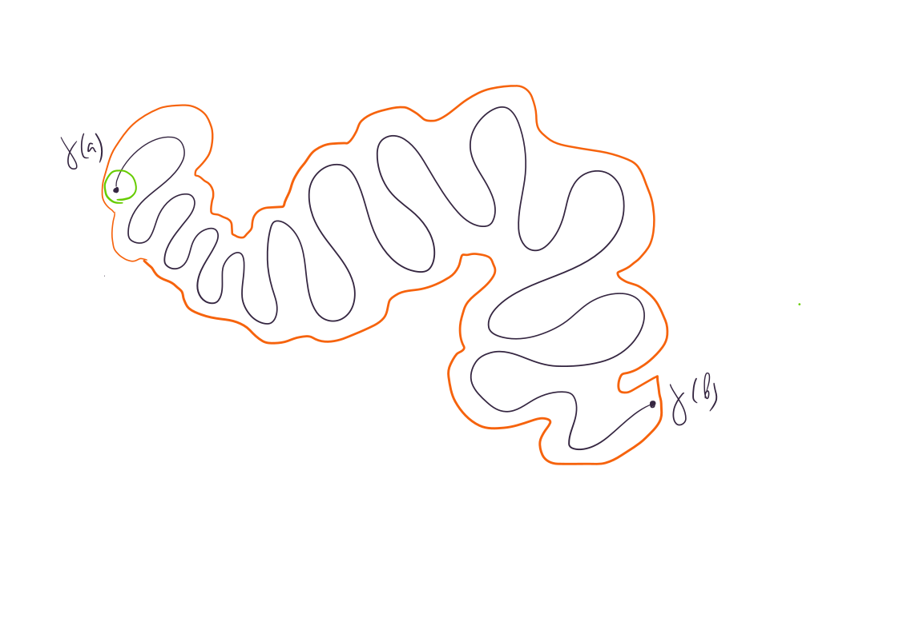{width=300 height=300}

{width=300 height=300}

## Теорема Жордана для кривых: компонент не меньше двух

:::: {#statement-42}

**Утверждение:**  Пусть $\gamma: [a, b] \to \mathbb{R}^2$ -- замкнутая непрерывная кривая без самопересечений. Пусть $\Gamma = \gamma([a, b])$ -- образ отображения $\gamma$ и $\Omega = \mathbb{R}^2 \setminus \Gamma$. Тогда $\Omega$ не является линейно связным.

*Доказательство:* 

::::

{width=300 height=300}

## Теорема Жордана для ломаных: компонент ровно две

:::: {#statement-43}

**Утверждение:**  Пусть $f: X_G \to \mathbb{R}^2$ вложение графа в плоскость. Пусть $\Gamma = f(X_G)$ -- образ графа при отображении $f$. Тогда $\mathbb{R}^2\setminus \Gamma$ содержит ровно одну неограниченную компоненту линейной связности.

*Доказательство:*

::::

:::: {#statement-44}

**Утверждение:**  Пусть $\gamma: [a, b] \to \mathbb{R}^2$ незамкнутая ломаная без самопересечений. Пусть $\Gamma = \gamma([a, b])$ -- образ отображения $\gamma$. Тогда $\mathbb{R}^2\setminus \Gamma$ линейно связно.

*Доказательство:*

::::

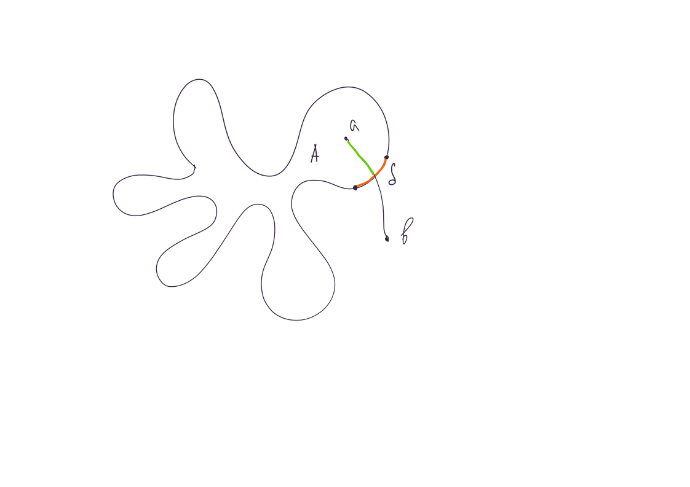{width=300 height=300}

:::: {#statement-45}

**Утверждение:**  Пусть $\gamma: [a, b] \to \mathbb{R}^2$ замкнутая ломаная без самопересечений. Пусть $\Gamma = \gamma([a, b])$ -- образ отображения $\gamma$. Пусть $A$ одна из компонент линейной связности $\mathbb{R}^2\setminus \Gamma$. Тогда граница $\partial A$ содержит $\Gamma$.

*Доказательство:* непонятно

::::

# Планарные графы

:::: {#definition-79}

**Определение:**  Пусть $A$ и $B$ подмножества множества $C$. $A \sqcup B$ обозначает, что $A \cap B = \varnothing$ и $C = A \cup B$.

::::

:::: {#definition-80}

**Определение:**  Пусть $G = (V, E, \partial)$ и $G’ = (V’, E’, \partial’)$ -- графы. *Отображение графа* $G$ *в граф* $G’$ -- это $f: V \sqcup E \to V’ \sqcup E’$, такое, что $f(V) \subset V’$, $f(E) \subset E’$ и $f(\partial(e)) = \partial’(f(e))\,\,\,\, \forall e \in E$. Если отображение $f$ графов $G$ и $G’$ взаимнооднозначно, то $f$ -- *изоморфизм* графов $G$ и $G’$, а графы $G$ и $G’$ -- *изоморфные*.  **Обозначается:** $G \cong G’$.

::::

:::: {#definition-81}

**Определение:**  Граф $G = (V, E, \partial)$ иногда называют *комбинаторным*.

::::

:::: {#statement-46}

**Утверждение:**  Отношение изоморфности на графах -- отношение эквивалентности.

*Доказательство:* $\,\,\,\,\blacksquare$

::::

:::: {#statement-47}

**Утверждение:**  Пусть $G \cong G’$. Тогда топологические графы $X_{G}$ и $X_{G’}$ гомеоморфны.

*Доказательство:* 

::::

:::: {#definition-82}

**Определение:**  Пусть $f: X_G \to Y$ -- вложение графа $G$ в пространство $Y$. Образ $f(X_G) \subset Y$ -- *геометрическая реализация* графа $G$. $f$-образы вершин и ребер графа $X_G$ -- *вершины и ребра геометрической реализации*. Существует взаимнооднозначное соответствие между вершинами и ребрами реализации и вершинами и ребрами графа, поэтому их можно отождествить и смотреть на геометрическую реализацию, как на множество точек(вершин) $Y$, соединенных непрерывными кривыми без самопересечений. В таком случае отображение инцидентности переводит кривую в множество ее концевых точек.

::::

:::: {#definition-83}

**Определение:**  Граф -- *планарный*, если существует его вложение в плоскость.

::::

:::: {#definition-84}

**Определение:**  Геометрическая реализация планарного графа -- *плоский граф*. 

::::

:::: {#definition-85}

**Определение:**  Пусть $\Gamma \subset \mathbb{R}^2$ -- плоский граф. Компоненты линейной связности $\mathbb{R}^2\setminus \Gamma$ -- *грани* $\Gamma$.

::::

:::: {#definition-86}

**Определение:**  Граф без циклов -- *лес*.

::::

:::: {#definition-87}

**Определение:**  *Подразбиение ребра* графа $G$ -- это ...

::::

## Формула Эйлера для плоских графов

:::: {#theorem-6}

**Теорема:**  (формула Эйлера) Пусть $G$ -- конечный плоский граф. $v, e, f, k$ -- количество его вершин, ребер, граней и компонет связности. Тогда справедлива формула:
$$v - e + f = 1 + k$$

*Доказательство:* 

::::

Можно доказывать для графа, все ребра которого отрезки, так как по утверждению можем построить граф, все ребра которого ломаные, а добавив в граф в качестве вершин точки ломаных, и вместо ребра-ломаной отдельные ребра для каждого звена ломаной, получим граф, для которого формула элера будет верна, если она была верна для исходного, и неверна иначе.

Индукция по количеству ребер $e$.

**База:** $e = 0$. Тогда $k = v$ и $f = 1 \,\,\,\,\blacksquare$

**Шаг:** Разберем два случая.

1. Пусть $G$ содержит цикл $C = v_{i_1}v_{i_2}\ldots v_{i_s}$ ($v_{i_1} = v_{i_k}$). Пусть ребро $e$ содержится в цикле. При выбрасывании $e$ количество ребер уменьшится на $1$, количество вершин и компонент связности графа не изменится. Докажем, что количество граней также не изменится.

По теореме Жордана $\mathbb{R}^2 \setminus C$ состоит из двух компонент линейной связности. Пусть $p$ произвольная внутренняя точка на ребре $e$. Пусть $U(p)$ окрестность $p$, такая, что $U(p)\cap (G \setminus e) = \varnothing$. Ломаная $C$ разбивает $U(p)$ на две компоненты линейной связности. Возьмем точки в разных компонентах $U(p)\setminus G$. До выбрасывания ребра $e$ они лежали в разных компонентах линейной связности $\mathbb{R}^2 \setminus C$. После выбрасывания они находятся в одной и той же компоненте. То есть количество граней уменьшилось хотя бы на $1$.

Докажем, что количество граней уменьшилось ровно на $1$. Пусть точки $a$ и $b$ до выбрасывания ребра $e$ были в одной грани, а после выбрасывания оказались в разных. Тогда можно соединить каждую из этих точек с $U(p)\setminus G$ ломаной, не пересекающей $G$, то есть точки до выбрасывания лежали в гранях, примыкающих к ребру $e$.

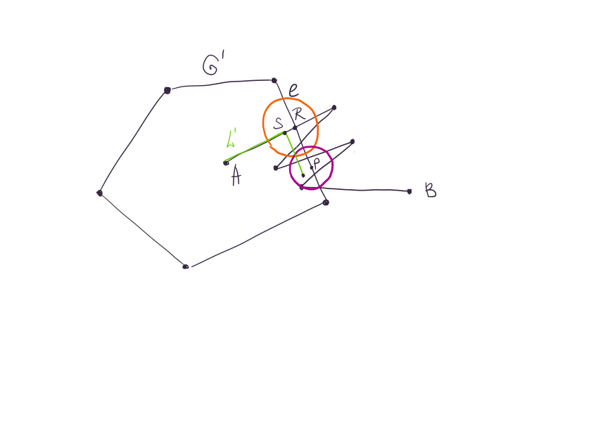{width=900 height=800}

2. Пусть $G$ не содержит циклов. Тогда в нем есть компонента связности -- дерево. Рассмотрим в нем вершину $v$ степени $1$. Пусть $e$ ребро инцидентное $v$. При выбрасывании $e$ количество ребер и вершин уменьшится на $1$, количество компонент связности графа не изменится. Докажем, что количество граней также не изменится.

Пусть точки $a$ и $b$ можно соединить ломаной, не пересекающей $G \setminus e$.

$\,\,\,\,\blacksquare$

## Критерий планарности графа (теорема Понтрягина-Куратовского)

:::: {#definition-88}

**Определение:**  Графы *гомеоморфны*, если гомеоморфны их топологические графы. 

::::

:::: {#theorem-7}

**Теорема:**  Граф $G$ -- планарен $\Leftrightarrow$ никакой подграф графа $G$ не гомеоморфен $K_{3, 3}$ или $K_5$.

*Доказательство:* $$\Rightarrow$$

::::

Графы $K_{3, 3}$ и $K_5$ непланарны $\,\,\,\,\blacksquare$

$$\Leftarrow$$

сложно

# Раскраски плоских графов

:::: {#definition-89}

**Определение:**  Пусть $\mathcal{C} = \{\operatorname{Col}_i\}$ некоторое множество, элементы которого назовем *цветами* или *красками*. Пусть $G = (V, E, \partial)$ -- граф. Отображение $\nu: V \to \mathcal{C}$ -- *раскраска* графа $G$ *цветами из множества* $\mathcal{C}$. При этом *вершина* $v$ *покрашена в цвет* $\nu(v)$. Раскраска графа *правильная*, если соседние вершины покрашены в различные цвета. Минимальное количество красок, необходимое для правильной раскраски графа -- *хроматическое число* графа $G$.

::::

:::: {#definition-90}

**Определение:**  Пусть $G = (V, E, \partial)$ -- граф. $v \in V$. Подграф графа $G$, состоящий из инцидентных $v$ вершин и ребер -- *линк* вершины $v$. **Обозначается:** $L(v)$. 

::::

:::: {#statement-48}

**Утверждение:**  Пусть $G$ -- простой конечный плоский граф. Тогда у графа $G$ существует вершина степени не больше пяти.

*Доказательство:* сакраментальные формулы + формула Эйлера $\,\,\,\,\blacksquare$

::::

:::: {#theorem-8}

**Теорема:**  (Хивуда о пяти красках) Пусть $G$ -- простой конечный плоский граф. Тогда хроматическое число графа $G$ не превосходит $5$.

*Доказательство:* Докажем по индукции по количеству вершин.

::::

**База:** Для $n \le 5$ очевидно $\,\,\,\,\blacksquare$

**Шаг:** [По утверждению](#statement-0) в $G$ есть вершина $v$ степени не больше пяти. Пусть $G’$ -- граф, полученный выбрасыванием $v$ и смежных с ней ребер. Вершины графа $G’$ можем раскрасить по предположению индукции. 

Если $\operatorname{deg}v \ne 5$, то покрасим $v$ в цвет отличный от цветов смежных с $v$ вершин.

Пусть $\operatorname{deg}v = 5$. 

Если вершины из линка $L(v)$ вершины $v$ покрашены менее чем в пять цветов, то покрасим $v$ в оставшийся.

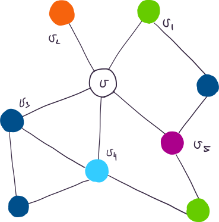{width=400 height=400}

Занумеруем вершины смежные с $v$ и если надо переобозначим цвета, так, чтобы вершина $v_i$ была покрашена в цвет $\operatorname{Col_i}$. Рассмотрим множество $X$ вершин, в которые существует путь из вершины $v_1$, проходящий только по вершинам, покрашенным в цвета $\operatorname{Col_1}$ и $\operatorname{Col_3}$. Если $v_3 \not\in X$, то перекрасим вершины множества $X$: вершину цвета $\operatorname{Col}_1$ в $\operatorname{Col}_3$ и вершины цвета $\operatorname{Col}_3$ в $\operatorname{Col}_1$, а $v$ покрасим в $\operatorname{Col}_1$.

{width=400 height=400}

Если $v \in X$, то существует маршрут из $v_1$ в $v_3$, проходящий только по вершинам цветов $\operatorname{Col}_1$ и $\operatorname{Col}_3$. Добавив к нему вершину $v$ и ребра $v_1v$ и $v_3v$, получим цикл $C$. По теореме Жордана этот цикл разбивает плоскость на две компоненты, причем точки $v_2$ и $v_4$ лежат в разных компонентах, то есть их нельзя соединить ломаной, не пересекающей $C$. Рассмотрим множество $Y$ вершин, в которые существует путь из вершины $v_2$, проходящий только по вершинам, покрашенным в цвета $\operatorname{Col_2}$ и $\operatorname{Col_4}$. $v_4 \not\in Y$, так как $v_2$ и $v_4$ нельзя соединить ломаной, не пересекающей $C \,\,\,\,\blacksquare$

## Лемма Шпернера

:::: {#definition-91}

**Определение:**  Пусть $\Gamma$ -- связный простой плоский граф, и выполнены следующие условия:   1. Любое ребро входит в границу $2$-x граней. 2. Любая конечная грань ограничена $3$ ребрами (такая грань -- *треугольник*). 3. Объединение конечных граней $W$ -- ограничено простой замкнутой ломаной. Тогда $G$ -- *триангуляция* $W$.

::::

:::: {#theorem-9}

**Теорема:**  (лемма Шпернера) Пусть $W$ -- треугольник, $\Gamma$ -- его триангуляция, причем вершины треугольника являются вершинами графа $G$. Пусть задана раскраска графа $G$ в три цвета и выполнено:

1. Вершины треугольника покрашены в разные цвета.
2. Вершины треугольника, лежащие на одной стороне, покрашены в два цвета.

Тогда существует треугольник триангуляции, вершины которого покрашены в различные цвета, и таких треугольников нечетное число.

*Доказательство:*

::::

:::: {#lemma-3}

**Лемма:**  (лемма Шпернера в двумерном случае) Пусть $a = t_0 < t_1 < \ldots < t_{s - 1} < t_s = b$ -- разбиение отрезка $[a, b]$. И эти точки покрашены в два цвета, причем точки $a$ и $b$ покрашены в различные цвета. Тогда среди отрезков $[t_{i - 1}, t_i]$ существует отрезок, концы которого покрашены в различные цвета, и таких отрезков нечетное число.

*Доказательство леммы:* 

{width=600 height=400}

$\,\,\,\,\blacksquare$

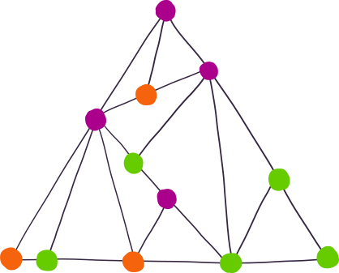{width=400 height=400}

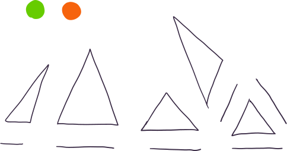{width=400 height=400}

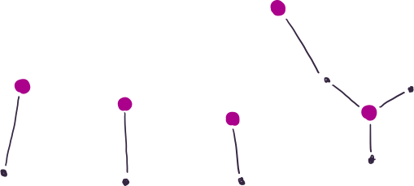{width=400 height=400}

картинки лажа, но доказательство понятное $\,\,\,\,\blacksquare$

## Как разрезать пирог, чтобы никто не обиделся?

**Упражнение:** Пусть дан прямоугольный пирог весом $1$ килограмм и три гостя. Нужно разрезать пирог двумя вертикальными разрезами, так, чтобы каждый из троих гостей выбрал себе кусок и все остались *довольны*, то есть все получили кусок ненулевой массы из замкнутого множества своих предпочтений (пусть множество предпочтений не зависит от предпочтений остальных гостей).

*Решение:* Все возможные разрезы описываются тройками чисел $(x_1, x_2, x_3)$, где $x_1 + x_2 + x_3 = 1$ и $x_i > 0$. ($x_i$ -- вес $i$-ого куска).

## Теорема Брауэра

:::: {#definition-92}

**Определение:**  Пусть $f: X \to X$ -- отображение. $x \in X$ -- *неподвижная точка отображения* $f$, если $f(x) = x$.

::::

**Теорема:** Непрерывное отображение замкнутого $n$-мерного шара в себя имеет неподвижную точку.

*Доказательство:* Вынос мозга $\,\,\,\,\blacksquare$

::::

# Многоугольники

Пусть $L \subset \mathbb{R}^2$ -- замкнутая ломаная без самопересечений. Тогда по теореме Жордана множество $\mathbb{R}^2\setminus L$ состоит из двух компонент линейной связности. При доказательстве теоремы Жордана была введена локально постоянная функция $\eta$, принимающая на $\mathbb{R}^2\setminus L$ два значения: $0$ и $1$.
Пусть $\Omega_1$ -- та компонента линейной связности $\mathbb{R}^2\setminus L$, на которой $\eta$ равна $1$, $\Omega_0$ -- та компонента линейной связности $\mathbb{R}^2\setminus L$, на которой $\eta$ равна $0$.

:::: {#statement-49}

**Утверждение:**  $\Omega_1$ -- ограничено, $\Omega_0$ -- неограничено.

*Доказательство:* Взять луч, который начинается "выше" ломаной. Плоскость без круга линейно связна $\,\,\,\,\blacksquare$

::::

:::: {#definition-93}

**Определение:**  Пусть $L \subset \mathbb{R}^2$ -- замкнутая ломаная без самопересечений. $F = L \cup \Omega_1$ -- *многоугольник*. ([$\Omega_1$ -- ограниченная компонента $\mathbb{R}^2\setminus L$](#statement-0)).   $\Omega_1$ -- *внутренность многоугольника* $F$ (Обозначается: $\operatorname{Int} F$),  $\Omega_0$ -- *внешность многоугольника* $F$ (Обозначается: $\operatorname{Out} F$).  $L$ -- *граница многоугольника* $F$ (Обозначается: $\partial F$). 

::::

**Замечание:** По утверждению граница многоугольника совпадает с топологической границей внешности и внутренности многоугольника.

## Многогранные поверхности и многогранники

:::: {#definition-94}

**Определение:**  *Пространственный многоугольник* -- это многоугольник, построенный в аффинной плоскости $\pi \subset \mathbb{R}^3$, при этом $\pi$ -- *плокость многогранника*.

::::

:::: {#definition-95}

**Определение:**  *Многогранная поверхность* $\mathcal{F}$ в $\mathbb{R}^3$ -- это конечное семейство $\{F_i\}$ пространственных многоугольников (*граней*), для которых выполнены следующие условия:

::::

1. $\forall i \ne j \,\,\,\, F_i \cap F_j$ или пусто, или состоит из одной общей для $F_i$ и $F_j$ вершины, или состоит из одного общего для $F_i$ и $F_j$ ребра $e$ (в этом случае грани $F_i$ и $F_j$ *смежны по ребру* $e$).

2. Для каждого ребра $e \in F_i$ существует не более одного многоугольника $F_j \,\,\,\, j \ne i$ смежного с $F_i$ по ребру $e$.

3. Для любых многогранников $F_i$ и $F_j, \,\,\,\, i \ne j$ существует последовательность многоугольников $F_i = F_{i1}, F_{i2}, \ldots, F_{is} = F_j$, такие что $\forall j \in \{1, \ldots s - 1\} \,\,\,\, F_{ij}$ смежен с $F_{ij+1}$ по некоторому ребру. Такая последовательность -- *цепочка многоугольников, соединяющая* $F_i$ и $F_j$.

4. Для любых двух многогранников, пересекающихся по вершине существует цепочка, соединяющая их, такая, что каждый из многоугольников, входящих в цепочку, содержит эту вершину.

5. Никакие две грани не лежат в одной плоскости.

:::: {#definition-96}

**Определение:**  Пусть $\mathcal{F} = \{F_i\}$ -- многогранная поверхность. Вершины и ребра граней $\mathcal{F}$ -- это *вершины и ребра* поверхности $\mathcal{F}$.

::::

:::: {#definition-97}

**Определение:**  Пусть $\mathcal{F} = \{F_i\}$ -- многогранная поверхность. Вершина (ребро), принадлежащая грани, *инцидентна* этой грани. Ребро инцидентное ровно одной грани -- *граничное*, иначе -- *внутреннее*.  Если у $\mathcal{F}$ нет граничных ребер, то $\mathcal{F}$ -- *замкнутая*.

::::

:::: {#theorem-10}

**Теорема:**  (теорема Жордана для многогранников) Пусть $\mathcal{F} \subset \mathbb{R}^3$ -- замкнутая многогранная поверхность. Тогда множество $\mathbb{R}^3\setminus \mathcal{F}$ состоит из двух открытых компонент линейной связности, причем $\mathcal{F}$ -- граница каждой из компонент. Одна из этих компонент -- ограниченное подмножество $\mathbb{R}^3$, а другая -- нет.

*Доказательство:* без доказательства $\,\,\,\,\blacksquare$

::::

:::: {#definition-98}

**Определение:**  *Многогранник* задается аналогично многоугольнику.

::::

## Графы многогранной поверхности

:::: {#definition-99}

**Определение:**  Пусть $\mathcal{F}$ -- многогранная поверхность. Пусть $V$ -- множество его вершин, $E$ -- множество его ребер. Тогда $G = (V, E)$ -- простой граф, вложенный в $\mathbb{R}^3$. $G$ -- *граф многогранной поверхности* $\mathcal{F}$.

::::

:::: {#statement-50}

**Утверждение:**  (Свойства графа многогранной поверхности)
 
Пусть $\mathcal{F}$ -- многогранная поверхность, $G$ -- ее граф. Тогда

1. $G$ -- простой и связный.
2. Степень любой вершины $v$ графа $G$ не меньше $2$ и равна $2$, если и только если оба выходящих из нее ребра -- граничные.

*Доказательство:* $\,\,\,\,\blacksquare$

::::

:::: {#definition-100}

**Определение:**  Пусть $\mathcal{F}$ -- многогранная поверхность. Пусть $V’ = \{F_i\}$, $E’$ совпадает с множеством ребер $\mathcal{F}$. Пусть $\partial’(e) = \{F_i, F_j\} \Leftrightarrow e$ является пересечением граней $F_i$ и $F_j$. Полученный граф $G = (V’, E’, \partial’)$ -- *двойственный граф многогранной поверхности*.

::::

:::: {#statement-51}

**Утверждение:**  (свойства двойственного графа) Пусть $\mathcal{F}$ -- замкнутая многогранная поверхность, $G’$ -- ее двойственный граф. Тогда

1. $G’$ -- простой и связный.
2. $\forall v \in V \,\,\,\, \operatorname{deg}v \ge 3$.

:::: {#definition-101}

**Определение:**  Количество ребер, ограничивающих грань многогранной поверхности, -- *гональность* или *степень грани*.

::::

## Выпуклые многогранники

:::: {#definition-102}

**Определение:**  Подмножество множества $\mathbb{R}^n$ -- *выпуклое*, если вместе с любыми двумя своими точками содержит отрезок, который их соединяет.

::::

**Утверждение:** Любое непустое пересечение выпуклых множеств -- выпукло.

*Доказательство:* $\,\,\,\,\blacksquare$

::::

:::: {#theorem-11}

**Теорема:**  Многогранник $W \subset \mathbb{R}^3$ выпуклый $\Leftrightarrow$ $W$ -- это пересечение замкнутых полупространств, ограниченных плоскостями, проходящими через грани $W$.

*Доказательство:* $$\Leftarrow$$

::::

[см. утверждение](#statement-3) $\,\,\,\,\blacksquare$

$$\Rightarrow$$

**Лемма 1:** Любая грань многогранника совпадает с пересечением многогранника и плоскости, содержащей эту грань.

*Доказательство:* вода-водой $\,\,\,\,\blacksquare$

**Лемма 2:** Пусть $F$ -- грань многогранника $W$, $\pi$ -- плоскость, содержащая $F$. Тогда $W$ целиком лежит в одном из замкнутых полупространств, ограниченных плоскостью $\pi$.

*Доказательство:* $\,\,\,\,\blacksquare$

Из этих лемм следует, что $W \subset \displaystyle\cap_{i = 1}^s \Pi_s$, где $\Pi_j$ -- закнутое полупространство, ограниченное $\pi_j$. Докажем, что $W = \displaystyle\cap_{i = 1}^s \Pi_s \,\,\,\,\blacksquare$

## Планарность графа выпуклого многогранника

:::: {#definition-103}

**Определение:**  (*радиальная проекция*)

::::

:::: {#statement-52}

**Утверждение:**  Граф выпуклого многогранника планарен.

*Доказательство:* радиальная проекция $\,\,\,\,\blacksquare$

::::

:::: {#definition-104}

**Определение:**  (*диаграмма Шлегеля*)

::::

:::: {#statement-53}

**Утверждение:**  Двойственный граф выпуклого многогранника планарен.

*Доказательство:* радиальная проекция на сферу внутри многогранника и утверждение про планарность графа многогранника $\,\,\,\,\blacksquare$

::::

## Формула Эйлера для многогранников

:::: {#statement-54}

**Утверждение:**  Пусть $W$ -- многогранник. $v$, $e$, $f$ -- количество его вершин, ребер и граней соответственно. Тогда $$v - e + f = 2$$

*Доказательство:* Следует из [планарности графа многогрнника](#statement-4) и формулы Эйлера для плоских графов $\,\,\,\,\blacksquare$

::::

## Правильные многогранники

:::: {#definition-105}

**Определение:**  Многогранник $W$ -- *правильный*, если каждая его вершина инцидентна одинаковому числу ребер и все двугранные углы между гранями равные.

::::

:::: {#definition-106}

**Определение:**  Пусть $\mathcal{F} = \{F_i\}$ - $n$-мерный многогранник. Семейство $F = \{F_0, \ldots, F_{n - 1}\}$ *граней*(вершины, ребра -- это тоже грани) многогранника -- *флаг*, если размерность $F_i$ равна $i$ и $F_i \subset F_{i + 1} \,\,\,\, \forall i$.

::::

:::: {#definition-107}

**Определение:**  Пусть $\mathcal{F} = \{F_i\}$ - $n$-мерный многогранник. $\mathcal{F}$ -- *правильный*, если для каждой пары его флагов существует движение многогранника, переводящее один из флагов в другой.

::::

:::: {#definition-108}

**Определение:**  Пусть $\mathcal{F} = \{F_i\}$ - $n$-мерный многогранник. $f = (k_0, \ldots, k_{n - 1})$, где $k_i$ -- количество $i$-мерных граней многогранника - $f$-*вектор* многогранника $\mathcal{F}$.

::::

## Теорема Минковского о «еже»

:::: {#definition-109}

**Определение:**  Пусть $\mathcal{F} \subset \mathbb{R}^3$ -- выпуклый многогранник. Пусть $F_1, \ldots, F_m$ -- грани $\mathcal{F}$. Пусть $\mathbf{n}_i$ -- единичный вектор, перпендикулярный грани $F_i$, направленный наружу многогранника $\mathcal{F}$, а $S_i$ -- площадь $F_i$. $\boldsymbol{\xi}_i = S_i \cdot \mathbf{n}_i$. Семейство $\{\boldsymbol{\xi}_i\}$ -- *ёж многогранника* $\mathcal{F}$.

::::

:::: {#statement-55}

**Утверждение:**  (Минковского о «еже») Пусть $\{\xi_1, \ldots, \xi_s\}$ - ёж многогранника $W$. Тогда $\displaystyle \sum_{i = 1}^{s}\xi_i = 0$ и $\xi_i$ некомпланарны.

*Доказательство:* Пусть векторы $\xi_i$ компланарны. Тогда все грани $W$ параллельны одной и той же прямой, а так как $W$ [равен пересечению полупространств, ограниченных плоскостями, проходящими через грани](#theorem-1), получаем, что $W$ неограничен. Противоречие.

::::

Докажем, что $\displaystyle \sum_{i = 1}^{s}\xi_i = 0$. $\,\,\,\,\blacksquare$

:::: {#theorem-12}

**Теорема:**  (Минковского о «еже») Пусть $\{\xi_1, \ldots, \xi_s\}$ некомпланарные векторы и $\displaystyle \sum_{i = 1}^{s}\xi_i = 0$. Тогда существует единственный с точностью до параллельного переноса многогранник, ёж которого равен $\{\xi_i\}$.

*Доказательство:*

::::

:::: {#statement-56}

**Утверждение:**  Выпуклый многогранник $W$ центрально симметричен $\Leftrightarrow$ для каждой $W$ существует параллельная грань той же площади.

*Доказательство:* $$\Rightarrow$$

::::

$\,\,\,\,\blacksquare$

# Равновеликость и равносоставленность

:::: {#definition-110}

**Определение:**  Пусть $F$ и $F_1, \ldots, F_m$ -- многоугольники, для которых выполнено:  $\forall i \ne j \,\,\,\, F_i \cap F_j = \varnothing$.  $F = \cup_{i = 1}^m F_i$.  Тогда многоугольник $F$ *разрезан на многоугольники* $F_i$.

::::

:::: {#definition-111}

**Определение:**  Пусть $F$ и $G$ -- многоугольники. Пусть $F$ разрезан на многоугольники $F_1, \ldots, F_s$ и $G$ разрезан на многоугольники $G_1, \ldots, G_s$. Если $\forall i \in \{1, \ldots, s\} \,\,\,\, G_i = F_i$, то многоугольники $F$ и $G$ -- *равносоставлены*.

::::

:::: {#definition-112}

**Определение:**  Многоугольники *равновеликие*, если они имеют одинаковую площадь.

::::

:::: {#theorem-13}

**Теорема:**  (Бойяи-Уоллес-Гервин) Если многоугольники равновелики, то они равносоставлены.

*Доказательство:* см. упражнение $\,\,\,\,\blacksquare$

::::

:::: {#definition-113}

**Определение:**  Пусть $F$ и $F_1, \ldots, F_m$ -- многогранники, для которых выполнено:  $\forall i \ne j \,\,\,\, F_i \cap F_j = \varnothing$.  $F = \cup_{i = 1}^m F_i$.  Тогда многоугольник $F$ *разрезан на многогранники* $F_i$.

::::

:::: {#definition-114}

**Определение:**  Пусть $F$ и $G$ -- многогранники. Пусть $F$ разрезан на многогранники $F_1, \ldots, F_s$ и $G$ разрезан на многогранники $G_1, \ldots, G_s$. Если $\forall i \in \{1, \ldots, s\} \,\,\,\, G_i = F_i$, то многогранники $F$ и $G$ -- *равносоставлены*.

::::

:::: {#definition-115}

**Определение:**  Многогранники *равновеликие*, если их объемы равны.

::::

## Инварианты Дена и критерий равносоставленности многогранников

:::: {#definition-116}

**Определение:**  Рассмотрим множество вещественных чисел $\mathbb{R}$, как векторное пространство над полем $\mathbb{Q}$. Обозначим полученное пространство $\mathbb{R}_{Q}$.

::::

:::: {#statement-57}

**Утверждение:**  Векторы (числа) $x_1, \ldots, x_n \in \mathbb{R}_Q$ линейно независимы $\Leftrightarrow \,\,\,\, \exists z_1, \ldots, z_n \in \mathbb{Z} (z_1^2 + \ldots z_n^2 \ne 0): \,\,\,\, z_1 x_1 + \ldots z_n x_n = 0$.

*Доказательство:* $\,\,\,\,\blacksquare$

::::

**Пример:** $\dim <1, \frac13> = 1$, а $\dim <1, \sqrt2> = 2$ (через $<x_1, x_2>$ обозначена линейная оболочка векторов $x_1, x_2 \in \mathbb{R}_Q$).

:::: {#lemma-4}

**Лемма:**  Пусть $X = \{x_i\}$ -- конечный набор вещественных чисел, $y \in \mathbb{R}$. Тогда любая линейная функция $f: L(X) \to \mathbb{R}$ продолжается до линейной функции на множестве $L(X \cup \{y\})$.

*Доказательство:* $\,\,\,\,\blacksquare$

::::

:::: {#definition-117}

**Определение:**  Пусть $W$ -- многогранник. Пусть $E$ множество ребер $W$. Обозначим длину ребра $e \in E$, как $|e|$, а двугранный угол при ребре $e$, как $\alpha_e$. Пусть $\alpha(W) = \{\alpha_e: \,\,\,\, e \in E\}$. Пусть $X \subset \mathbb{R}$ конечное множество вещественных чисел, содержащее $\alpha(W)$ и $\pi$. Обозначим $L(X)$ -- линейную оболочку $X$. Линейная функция $f: L(X) \to \mathbb{R}$, для которой $f(\pi) = 0$ -- *функция Дена многогранника* $W$, а число $\Delta_f(W) = \displaystyle \sum_{e \in E}|e|\cdot f(\alpha_e)$ -- *инвариант Дена многогранника* $W$.

::::

### Инварианты Дена для куба и призмы

:::: {#statement-58}

**Утверждение:**  Каждый инвариант Дена для куба равен нулю.

*Доказательство:* очевидно $\,\,\,\,\blacksquare$

::::

:::: {#statement-59}

**Утверждение:**  Каждый инвариант Дена для призмы равен нулю.

*Доказательство:* вспомнить определение призмы $\,\,\,\,\blacksquare$

::::

### Необходимое условие равносоставленности многогранников (теорема Дена)

:::: {#statement-60}

**Утверждение:**  (аддитивность инварианта Дена) Пусть $W$ -- многогранник, разрезанный на многогранники $W_1, \ldots, W_m$. Пусть $f$ -- функция Дена для $W$. [По лемме](#lemma-1) можем продолжить, так, чтобы $f$ была функцией Дена для всех $W_i$. Тогда $$\Delta_f(W) = \displaystyle \sum_{i = 1}^{m}\Delta_f(W_i)$$

*Доказательство:* Пусть $e$ ребро одного из многогранников $W, W_1, \ldots, W_m$. Рассмотрим множество $X$, состоящее из всех вершин многогранников $W, W_1, \ldots, W_m$, попавших на $e$ и всех точек пересечения ребер многогранников $W, W_1, \ldots, W_m$ с ребром $e$ (как будто вершины тоже точки пересечения). Назовем *звеньями* отрезки, на которые точки из $X$ делят $e$. Пусть $\mathcal{E}$ множество всех звеньев, находящихся на ребрах многогранника $W$. 

::::

Дальше много сумм $\,\,\,\,\blacksquare$ 

:::: {#theorem-14}

**Теорема:**  Пусть $A$ и $B$ -- равносоставленные многогранники, а $f$ -- функция Дена для $A$ и $B$. Тогда $\Delta_f(A) = \Delta_f(B)$.

*Доказательство:* [см. утверждение](#statement-4) $\,\,\,\,\blacksquare$

::::

### Применения теоремы Дена

:::: {#lemma-5}

**Лемма:**  Число $\frac1{\pi}\operatorname{arccos}\frac13$ иррационально.

*Доказательство:* Пусть $\alpha = \operatorname{arccos}\frac13$. Докажем, что при $k \in \mathbb{N} \,\,\,\, \cos(k\cdot \alpha) = \frac{a_k}{3^k}$, где $a_k$ не делится на $3$.

::::

Докажем по индукции.

**База:** $n = 1$ верно. $n = 2$ верно, так как $\cos(2 \alpha) = 2\cdot \cos^2(\alpha) - 1 = -\frac79$

**Шаг:** Пусть для всех $k < n$ утверждение верно. Имеем $\cos(n \alpha) + \cos((n - 2) \alpha) = 2 \cos((n - 1)\alpha)\cos(\alpha) = 2 \cdot \frac{a_{n - 1}}{3^{n - 1}}\cdot \frac13$, то есть $\cos(n \alpha) = 2 \cdot \frac{a_{n - 1}}{3^n} - \frac{a_{n - 2}}{3^{n - 2}}$. Число $a_{n - 1} - 9 a_{n - 2}$ не делится на три, так как $a_{n - 1}$ и $a_{n - 2}$ не делятся на три по предположению индукции.

Пусть $\frac1{\pi}\alpha = \frac{p}{q}, \,\,\,\, p \in \mathbb{Z}, \,\,\,\, q \in \mathbb{N} \Rightarrow \cos(q \alpha) = \cos(p \pi) = \pm 1$, что противоречит доказанному выше утверждению $\,\,\,\,\blacksquare$

:::: {#statement-61}

**Утверждение:**  Правильный тетраэдр и куб не равносоставлены.

*Доказательство:* Все двугранные углы куба равны $\frac{\pi}2$, а все двугранные углы правильного тетраэдра равны $\operatorname{arccos}\frac13$. Векторы $\pi$ и $\operatorname{arccos}\frac13$ линейно независимы в $\mathbb{R}_Q$ [по лемме](#lemma-0). $\dim <\alpha, \pi> = 2, \,\,\,\, \frac{\pi}2 \in <\alpha, \pi>$ и $\alpha, \pi$ -- базис в $<\alpha, \pi>$. То есть $X = \{\alpha, \pi\}$ подходящее множество для инварианта Дена. Зададим $f$ на $<\alpha, \pi>$: $f(\alpha) = 1, \,\,\,\, f(\pi) = 0$. $f$ -- функция Дена для куба и тетраэдра. [По утверждению](#statement-1) $\Delta_f($ куба $) = 0 \,\,\,\, \forall f$. Посчитаем инвариант Дена для тетраэдра $S$ (пусть все его ребра равны $1$): $\Delta_f(S) = \displaystyle \sum_{i = 1}^{6}1 \cdot f(\alpha) = 6$. [По теореме тетраэдр и куб не равносоставлены](#theorem-1) $\,\,\,\,\blacksquare$

::::

## Решение третьей проблемы Гильберта

:::: {#definition-118}

**Определение:**  Многогранники $A$ и $B$ -- *равнодополняемые*, если существуют многогранники $W^A$ и $W^B$, которые можно можно разрезать на многогранники $W^A_0, \ldots W^A_n$ и $W^B_0, \ldots W^B_n$ соответственно, так, чтобы $W^A_0 = A, \,\,\,\, W^B_0 = B$ и $W^A_i = W^B_i \,\,\,\, \forall i \in \{1, \ldots, n\}$.

::::

:::: {#corollary-6}

**Следствие:**  У равнодополняемых многогранников все инварианты Дена совпадают.

*Доказательство:* [см. утверждение](#statement-4) и еще [теорему](#theorem-1) $\,\,\,\,\blacksquare$

::::

**третья проблема Гильберта:** Существуют ли не равнодополняемые (в частности, не равносоставленные) тетраэдры с одинаковыми высотами и основаниями?

### Тетраэдр Хилла

:::: {#definition-119}

**Определение:**  Тетраэдр, в основании которого расположен равнобедренный прямоугольный треугольник, высота которого падает на один из концов гипотенузы и равна длине катета основания -- *тетраэдр Хилла*.

::::

:::: {#statement-62}

**Утверждение:**  Тетраэдр Хилла равносоставлен с кубом.

*Доказательство:*

::::

:::: {#corollary-7}

**Следствие:**  Любой инвариант Дена тетраэдра Хилла равен нулю.

*Доказательство:* [см. утверждение](#statement-1) $\,\,\,\,\blacksquare$

::::

:::: {#definition-120}

**Определение:**  *Координатный тетраэдр* -- тетраэдр, координаты которого в прямоугольной системе координат равны: $(0, 0, 0, 0), \,\,\,\, (1, 0, 0, 0), \,\,\,\, (0, 1, 0, 0), \,\,\,\, (0, 0, 0, 1)$.

::::

:::: {#statement-63}

**Утверждение:**  Для координатного тетраэдра существует инвариант Дена отличный от нуля.

*Доказательство:* [аналогично доказательству](#statement-3) $\,\,\,\,\blacksquare$

::::

:::: {#corollary-8}

**Следствие:**  Тетраэдр Хилла, у которого катеты основания равны $1$, и координатный тетраэдр неравнодополняемы.

*Доказательство:* [это](#corollary-1), [это](#statement-6) и [это](#corollary-0) $\,\,\,\,\blacksquare$

::::

## Достаточное условие равносоставленности многогранников

:::: {#theorem-15}

**Теорема:** (Ден-Сидлер) Многогранники равнодополняемы $\Leftrightarrow$ все их инварианты Дена равны и их объемы совпадают.

*Доказательство:* без доказательства $\,\,\,\,\blacksquare$

::::

# Топологическая классификация многогранных поверхностей

:::: {#definition-121}

**Определение:** *Связная многогранная поверхность* $\mathcal{F}$ в $\mathbb{R}^n$ -- это конечное семейство $\{F_i \subset \mathbb{R}^n\}$ пространственных многоугольников (*граней*), для которых выполнены следующие условия:

1. $\forall i \ne j \,\,\,\, F_i \cap F_j$ или пусто, или состоит из одной общей для $F_i$ и $F_j$ вершины, или состоит из одного общего для $F_i$ и $F_j$ ребра $e$ (в этом случае грани $F_i$ и $F_j$ *смежны по ребру* $e$).

2. Для каждого ребра $e \in F_i$ существует не более одного многоугольника $F_j \,\,\,\, j \ne i$ смежного с $F_i$ по ребру $e$.

3. Для любых многогранников $F_i$ и $F_j, \,\,\,\, i \ne j$ существует последовательность многоугольников $F_i = F_{i1}, F_{i2}, \ldots, F_{is} = F_j$, такие что $\forall j \in \{1, \ldots s - 1\} \,\,\,\, F_{ij}$ смежен с $F_{ij+1}$ по некоторому ребру. Такая последовательность -- *цепочка многоугольников, соединяющая* $F_i$ и $F_j$.

4. Для любых двух многогранников, пересекающихся по вершине существует цепочка, соединяющая их, такая, что каждый из многоугольников, входящих в цепочку, содержит эту вершину.

(Убрали требование «никакие две грани не лежат в одной плоскости»)

::::

:::: {#definition-122}

**Определение:**  Пусть $\mathcal{F} = \{F_i\}$ -- многогранная поверхность $\mathcal{F}$ -- это *вершины и ребра* поверхности $\mathcal{F}$.

::::

:::: {#definition-123}

**Определение:**  Пусть $\mathcal{F} = \{F_i\}$ -- многогранная поверхность. Вершина (ребро), принадлежащая грани, *инцидентна* этой грани. Ребро инцидентное ровно одной грани -- *граничное*, иначе -- *внутреннее*.  Если у $\mathcal{F}$ нет граничных ребер, то $\mathcal{F}$ -- *замкнутая*.

::::

:::: {#definition-124}

**Определение:**  Связная многогранная поверхность в $\mathbb{R}^n$ - $n$-*мерная*. (хотя она в $n + 1$)

::::

Поверхность $\mathcal{F}$ подмножество $\mathbb{R}^3$, поэтому на нем можно задать индуцированную из $\mathbb{R}^3$ топологию.

Можно задать топологию на $\mathcal{F}$, склеив по ребрам несвязную сумму индуцированных из плоскости топологий на гранях.

:::: {#definition-125}

**Определение:**  Так как теперь в определении поверхности не нужно, чтобы грани не лежали в одной плоскости, можем разбить каждую грань на треугольники. Подученная при этом поверхность -- *триангулированная*.

::::

:::: {#statement-64}

**Утверждение:**  Любая связная замкнутая многогранная поверхность гомеоморфна некоторой поверхности, полученной из многоугольника склейкой его сторон.

*Доказательство:* 

::::

{width=300 height=300}

:::: {#definition-126}

**Определение:**  Пусть $\mathcal{F}$ -- связная многогранная поверхность. Пометим все ребра $\mathcal{F}$ стрелками и буквами. Будем обходить многогранник по его границе и записывать последовательно буквы ребер по правилу: если идем в направлении стрелки, то саму букву, иначе букву в степени $-1$. Полученная последовательность букв -- *слово склейки* поверхности $\mathcal{F}$.

::::

## Модельные поверхности

**Обозначения:**

$S^2$ -- сфера.

$\mu$ -- пленка Мёбиуса.

$D^2$ -- диск (круг).

:::: {#definition-127}

**Определение:**  *Элементарные операции* с поверхностями -- это:  1. *Вырезание диска*. 2. *Приклеивание ручки*. 1. *Вклейка пленки Мёбиуса*.

::::

:::: {#definition-128}

**Определение:**  *Сфера с* $g$ *ручками* -- это поверхность, полученная приклеиванием к сфере $g$ ручек.

**Обозначается:** $M_g$

::::

:::: {#definition-129}

**Определение:**  *Сфера с* $m$ *пленками Мёбиуса* -- это поверхность, полученная вклейкой в сферу $m$ пленок Мёбиуса.

**Обозначается:** $N_m$

::::

**Замечание:** Сфера с $0$ ручками -- это просто сфера. Сферы с пленками Мёбиуса рассматриваются для $m \ge 1$.

:::: {#statement-65}

**Утверждение:**  Слово склейки для $M_g$ имеет вид $a_1b_1a_1^{-1}b_1^{-1}\ldots a_kb_ka_k^{-1}b_k^{-1}$, слово склейки для $N_m$ имеет вид $a_1^2\ldots a_m^2$.

*Доказательство:*

::::

:::: {#definition-130}

**Определение:**  Сфера с $g$ ручками и сфера с $m$ пленками Мёбиуса -- это *модельные поверхности*.

::::

:::: {#theorem-16}

**Теорема:** Каждая связная двумерная замкнутая многогранная поверхность гомеоморфна одной из модельных поверхностей.

*Доказательство:* куча картинок $\,\,\,\,\blacksquare$

::::

## Ориентация многогранных поверхностей

:::: {#definition-131}

**Определение:**  Пусть $\mathcal{F}$ -- связная замкнутая двумерная многогранная поверхность. $F_1, \ldots, F_m$ -- ее грани. У каждой грани можно задать *ориентацию* (направление обхода границы или задать ориентацию плоскости, содержащей грань).  Пусть $e$ -- ребро $\mathcal{F}$. Оно инцидентно двум граням $F_i$ и $F_j$, в которых задана ориентация, то есть на ребре $e$ указаны два направления. Если эти направления совпадают, то ориентации граней $F_i$ и $F_j$ -- *согласованы*.

::::

:::: {#definition-132}

**Определение:**  Многогранная поверхность *ориентирована*, если у каждой ее грани задана ориентация и для каждой пары смежных граней ориентации согласованы.  Семейство согласованных ориентаций граней -- *ориентация поверхности*. Если существует ориентация поверхности, то поверхность -- *ориентируемая*.

::::

:::: {#definition-133}

**Определение:**  Пусть $\mathcal{F}$ -- связная замкнутая двумерная многогранная поверхность. Рассмотрим замкнутую цепочку граней $F_1, \ldots, F_m$ (замкнутая - $F_1$ смежна с $F_m$). Зададим на каждой грани цепочки ориентацию. Если ориентации $F_1$ и $F_m$ согласованы, то *цепочка сохраняет ориентацию*, в ином случае *цепочка обращает ориентацию*.

::::

:::: {#statement-66}

**Утверждение:** Связная двумерная многогранная поверхность $\mathcal{F}$ ориентируема $\Leftrightarrow$ в $\mathcal{F}$ нет цепочек обращающих ориентацию.

*Доказательство:*

::::

:::: {#statement-67}

**Утверждение:** Поверхность, содержащая лист Мёбиуса, неориентируема.

*Доказательство:*

::::

:::: {#statement-68}

**Утверждение:** Гомеоморфные многогранные поверхности ориентируемы или неориентируемы одновременно.

*Доказательство:*

::::

## Эйлерова характеристика

:::: {#definition-134}

**Определение:**  *Эйлерова характеристика* многогранной поверхности -- это число $v - e + f$, где $v$ -- число вершин, $e$ -- число ребер и $f$ -- число граней поверхности. 

::::

:::: {#statement-69}

**Утверждение:** Эйлерова характеристика любых поверхности не зависит от разбиения на грани и не меняется при гомеоморфизмах.

*Доказательство:*

::::

:::: {#theorem-17}

**Теорема:** Если многогранные поверхности гомеоморфны разным модельным поверхностям, то они не гомеоморфны.

*Доказательство:*

::::

